# SAROTHI SHEBA — Ultimate Refinement Plan

> **Status:** Architecture & roadmap document. **No implementation code has been written.**
> **Authored:** 2026-07-28
> **Repo:** `F:\sarothi\SAROTHI-SHEBA` · branch `main` · 26 source files · ~6,021 LOC
> **Knowledge graph:** `graphify-out/` — 278 nodes, 506 edges, 26 communities (already generated; not re-run)

---

## How to read this document

| Section | What it answers |
|---|---|
| [§0 Locked Decisions](#0-locked-decisions) | The four constraints that shaped every recommendation below |
| [§1 Current State Analysis](#1-current-state-analysis) | What the repo actually is, and every defect with `file:line` |
| [§2 Target Architecture](#2-the-over-the-edge-target-architecture) | The system we are building toward, with full schema DDL |
| [§3 Tool Stack Matrix](#3-the-multi-layered-tool-stack-matrix) | 22 categories, 2–3 researched options each, trade-offs, picks |
| [§4 Deep Backend/Database Logic](#4-deep-backenddatabase-logic) | Concurrency, isolation, geospatial, outbox, RLS blueprints |
| [§5 Execution Roadmap](#5-execution-roadmap) | 10 phases, each ending in a Human Learning Checkpoint |
| [§6 Appendices](#6-appendices) | Defect register, glossary, sources |

**Companion files:** [`plan.md`](./plan.md) is the short working view we open each session. [`progress.md`](./progress.md) is the live tracker.

---

## §0 Locked Decisions

These were decided before writing and constrain everything downstream. They are recorded here so that if we ever revisit a recommendation, we know *why* it was chosen.

| # | Decision | Choice | Consequence |
|---|---|---|---|
| D1 | Deployment target | **Docker Compose, laptop-only** | Production-grade *patterns*, zero cloud spend. Rules out managed Kafka, K8s, service mesh. Drives Redpanda over Kafka, `grafana/otel-lgtm` over SigNoz. |
| D2 | Language | **Stay in JavaScript** (CommonJS backend, ESM frontend) | No TypeScript migration. Rules out Drizzle/Prisma (TS-first). Drives hand-written SQL + `node-pg-migrate` + **Zod** for runtime validation. |
| D3 | Migration strategy | **Strangler fig on this repo** | The app boots and works at the end of *every* phase. No big-bang rewrite. No new monorepo. |
| D4 | Docs & pacing | **Repo root, one checkpoint per phase** | 10 Human Learning Checkpoints total, each a deep-dive before code generation for that phase. |

**On D2 specifically:** staying in JavaScript is not a downgrade here. The single biggest risk to this project is *magic you don't understand*. An ORM would hide exactly the queries — `FOR UPDATE SKIP LOCKED`, `pg_advisory_xact_lock`, PostGIS `ST_DWithin`, `SET LOCAL app.current_user_id` — that this refinement is *about*. We write those by hand and you read every one. We recover the type safety we're giving up through three cheaper mechanisms: Zod schemas at every I/O boundary (runtime, which is where it actually matters), JSDoc + `jsconfig.json { "checkJs": true }` for editor-level inference with zero build step, and database constraints that make invalid data impossible regardless of what the application layer believes.

---

## §1 Current State Analysis

### 1.1 What this repo is

A three-tier ride-sharing application for Bangladesh, built as a database term project.

```
SAROTHI-SHEBA/
├── backend/                    Express 5 API — CommonJS, no build step
│   ├── startPoint.js           Server bootstrap + Socket.IO (82 LOC)
│   ├── routes/routes.js        Single flat router, 28 routes (71 LOC)
│   ├── middleware/
│   │   ├── authMiddleware.js   JWT verify + 3 unused role helpers (70 LOC)
│   │   └── tokenBlacklist.js   In-memory Map (45 LOC) ⚠️ DOES NOT PARSE
│   └── controller/             16 controllers, one file per feature
├── database/
│   ├── db.js                   pg Pool + a query() that fakes transactions (63 LOC)
│   ├── schema.sql              11 CREATE TABLEs, mostly-commented seed data (286 LOC)
│   └── functions.sql           1 function, 1 trigger, 1 procedure (85 LOC)
├── frontend/                   React 19.2 + Vite 8 — ESM
│   └── src/
│       ├── context/            AuthContext (46), SocketContext (62)
│       ├── services/api.js     18-line fetch wrapper — the only network layer
│       ├── pages/              14 page components, 52–552 LOC each
│       └── index.css           1,016 lines, single file, entire design system
└── public/index.html           Dead legacy static prototype
```

**Stack as it stands:** Express 5.2 · `pg` 8.20 (raw, no ORM) · `jsonwebtoken` 9 · Socket.IO 4.8 · `sslcommerz-lts` 1.2 · PostgreSQL · React 19.2 · Vite 8 · react-leaflet 5 / Leaflet 1.9 · react-router-dom 7.13 · react-hot-toast · lucide-react.

Credit where due: the dependency versions are genuinely current, Express 5 was a good call (native async error propagation), the CSS design-token system in `index.css` is well-structured, and using a stored procedure for `complete_ride` shows the right instinct about where transactional logic belongs. The problems below are architectural, not a matter of carelessness.

### 1.2 What the knowledge graph tells us

From `graphify-out/GRAPH_REPORT.md`:

| Signal | Value | What it means architecturally |
|---|---|---|
| `query()` god node | **52 edges** | Every controller talks straight to raw SQL. There is no repository, service, or domain layer. Change the DB shape and you touch 16 files. |
| `useAuth()` | 31 edges | Auth state is correctly centralized on the frontend — this one is fine. |
| `api()` | 27 edges | Single network chokepoint. Good news: refactoring the transport (cookies, refresh, retries) is *one file*. |
| Isolated nodes | **102 (≤1 connection)** | Overwhelmingly the repeated `{ query }` import. Confirms the flat, layerless design. |
| Import cycles | None | Genuinely clean. Nothing to untangle. |
| Community cohesion | 0.07–0.13 on the big ones | "React App Pages & Contexts" and the dependency clusters are weakly interconnected — pages are near-duplicates of each other rather than sharing components. |

**The headline:** `query()` at 52 edges is not a utility, it is *the entire data-access architecture*. Section [§4.1](#41-the-transaction-problem) shows why that function's design makes correct multi-statement transactions **impossible** — which is the root cause of roughly a third of the defects below.

### 1.3 P0 — the application cannot start

#### P0-1 · `backend/middleware/tokenBlacklist.js:7` — SyntaxError

Line 7 is English prose sitting in the middle of a function body:

```js
function blacklistToken(token, exp) {
    if (!token) {
        return;
    }
    This line calculates the token's expiration time in **milliseconds**. It's a one-line `if-else` statement (a ternary operator).
```

Verified:

```console
$ node --check backend/middleware/tokenBlacklist.js
backend/middleware/tokenBlacklist.js:7
    This line calculates the token's expiration time in **milliseconds**...
         ^^^^
SyntaxError: Unexpected identifier
```

`This line` parses as two consecutive identifiers. Node aborts at parse time — before executing a single statement. `authMiddleware.js:3` requires this module, `routes.js:5` requires that, `startPoint.js:6` requires that. **The entire backend fails to load.**

Almost certainly an AI explanation pasted in without comment markers — note lines 9–11 immediately below *are* correctly commented, so the intent was a comment block and the first line lost its `//`.

#### P0-2 · `backend/routes/routes.js:46` — undefined route handler

```js
// line 4 — adminRejectDriver is NOT in this destructure:
const { registerPage, registerAsAdmin, registerAsDriver, adminApproveDriver,
        registerVehicle, registerAsPassenger } = require('../controller/register');
...
// line 46 — but it's used here:
router.post('/admin/reject-driver', authMiddleware, adminRejectDriver);
```

`register.js:246` **does** export `adminRejectDriver`. The import just missed it. At runtime Express throws:

```
TypeError: Route.post() requires a callback function but got a [object Undefined]
```

This one is masked by P0-1 — you will only see it after fixing the syntax error. Fix both together or you will think the first fix failed.

> **These two defects mean the backend has never run in its current committed state.** Any plan that starts anywhere else is fiction. Phase 0 fixes these first.

#### P0-3 · Secrets committed to a public repository

`backend/.env` is **tracked in git**:

```console
$ git ls-files | grep -i "\.env"
backend/.env

$ git log --oneline --diff-filter=A -- backend/.env
6749d1d primery learning JWT
```

Present since commit `6749d1d` and pushed to `github.com/Naeem-Shuvo/SAROTHI-SHEBA`. Exposed keys:

| Key | Impact |
|---|---|
| `JWT_SECRET` | Forge a token for **any** user id and role. Complete authentication bypass. |
| `PG_PASSWORD` | Direct database access if the host is ever reachable. |
| `SSLCOMMERZ_STORE_ID` / `SSLCOMMERZ_STORE_PASSWORD` | Third-party payment gateway credentials. Real money, real merchant account. |
| `ADMIN_LEVEL1` / `ADMIN_LEVEL2` | **See below — this is the worst one.** |

The `ADMIN_LEVEL*` values are not a hint or a seed. They are the *entire* admin authorization check (`register.js:82-88`):

```js
if(admin_secret===process.env.ADMIN_LEVEL1){ lvl=1; }
else if(admin_secret===process.env.ADMIN_LEVEL2){ lvl=2; }
else { return res.status(403).json({msg:'Invalid admin secret'}); }
```

Any person who reads the repository registers an account, posts that string to `/register/admin`, and becomes a level-2 administrator. **Reading the repo *is* the privilege escalation.** There is no second factor, no allowlist, no audit trail.

`.gitignore` *does* list `.env` — but git only ignores files it isn't already tracking. Adding a rule after the fact does nothing.

#### P0-4 · 1,145 `node_modules` files tracked

```console
$ git ls-files | wc -l          → 1213
$ git ls-files | grep -c node_modules → 1145
```

**94% of the tracked repository is vendored dependencies.** Plus 4 `.DS_Store`. Same root cause as P0-3: `.gitignore` was added in `db5f3d2`, after the files were already committed.

#### P0-5 · `database/db.js:6` — hardcoded password fallback

```js
password: process.env.PG_PASSWORD || 'NewPassword123',
```

A real credential in source. Worse than the leak itself is the *silent fallback*: with a missing or typo'd `PG_PASSWORD`, the app doesn't fail loudly — it quietly tries a different password and produces a confusing connection error. Config should fail fast and loud (Phase 1).

### 1.4 P1 — security

#### P1-1 · Unsalted SHA-256 password hashing

`register.js:40` and `login.js:49`:

```js
const hashedPass = crypto.createHash('sha256').update(password).digest('hex');
```

Three independent failures:

1. **No salt.** Identical passwords → identical hashes. One rainbow table breaks every user at once, and the hash column itself leaks which users share a password.
2. **No work factor.** SHA-256 is engineered to be *fast* — that is its purpose. A consumer GPU does billions per second. Password hashes must be *deliberately slow*.
3. **Wrong primitive entirely.** SHA-256 is a message-digest function. Password storage needs a memory-hard KDF: Argon2id, scrypt, or bcrypt.

Fix in Phase 5: **Argon2id** with transparent rehash-on-login, so existing users migrate without a forced reset.

#### P1-2 · Socket.IO has no authentication — live GPS is world-readable

`startPoint.js:28-49`:

```js
io.on('connection', (socket) => {          // ← no auth handshake
    socket.on('join_room', (roomId) => {
        socket.join(`user_${roomId}`);      // ← joins ANY room on request
    });
    socket.on('join_drivers', () => {
        socket.join('drivers');             // ← claims to be a driver, no check
    });
    socket.on('driver_location_update', (data) => {
        socket.to(`user_${data.passenger_id}`).emit('driver_location_update', data);
    });
});
```

The HTTP API is behind `authMiddleware`. The WebSocket layer has **nothing**. Concretely, with no account at all:

```js
const s = io('http://localhost:4000');
s.emit('join_room', 42);                       // now in passenger 42's private room
s.on('driver_location_update', console.log);   // live GPS of their driver, in real time
s.on('ride_accepted', console.log);            // their pickup and drop addresses
```

This is a textbook **IDOR**, and the leaked data is physical-location-of-a-real-person. It is the single most serious *design* flaw in the codebase. `join_drivers` is equally open — anyone can watch every ride request in the city, and `driver_location_update` accepts an arbitrary `passenger_id`, so anyone can also *forge* a driver's position.

Fix in Phase 5: JWT in the handshake, server-derived rooms (never client-supplied), per-event authorization.

#### P1-3 · JWT in `localStorage`

`AuthContext.jsx:18` and `api.js:3`. Any XSS — a bad dependency, an unescaped render — reads the token instantly. Phase 5 moves to `httpOnly; Secure; SameSite=Strict` cookies with a short-lived access token plus a rotating refresh token.

#### P1-4 · `cors({origin:'*'})` with no helmet, no rate limiting, no validation

`startPoint.js:13`. Any origin may call the API. There is no `helmet`, no rate limiter (so `/login` is a free brute-force oracle for an unsalted-SHA256 database), and no schema validation — every controller hand-rolls `if (!x) return 400`.

#### P1-5 · Authorization logic copy-pasted across 16 controllers

`authMiddleware.js:37-70` defines `requireAdmin`, `requireDriver`, `requirePassenger`. They are **barely used**. Instead every controller re-implements the check inline:

```js
if (!decoded || decoded.role !== 'driver')    { ... }   // rideAccept.js:7
if (!decoded || decoded.role !== 'passenger') { ... }   // rideRequest.js:6
if (!decoded || decoded.role !== 'driver')    { ... }   // availableRides.js:6
if (!decoded || decoded.role !== 'admin')     { ... }   // adminUsers.js:8, :43
if (!adminDecoded || adminDecoded.role!=='admin') { ... } // register.js:129, :219
```

Six variants of the same idea, with subtly different messages and status codes (`401` in `register.js`, `403` in `adminUsers.js` — for the same condition). A role check that is 16 opportunities to forget is a role check that will eventually be forgotten. Phase 5 makes it declarative at the route table.

Note also `requireDriver` (`authMiddleware.js:49-63`) is **wrong**: it returns `true` if a `drivers` row exists, ignoring whether that driver is `active`. A rejected or deactivated driver still passes.

### 1.5 P1 — correctness and concurrency

#### P1-6 · The `query()` helper makes real transactions impossible

`database/db.js:25-52` is the crux. It inspects the SQL string, and if it starts with `INSERT|UPDATE|DELETE|CALL`, wraps **that one statement** in `BEGIN`/`COMMIT` on a dedicated connection:

```js
async function query(text, params) {
    const isDml = /^(INSERT|UPDATE|DELETE|CALL)\b/.test(sql);
    if (!isDml) return pool.query(text, params);      // reads: pooled, no txn
    const client = await pool.connect();               // writes: new connection
    try {
        await client.query('BEGIN');
        const result = await client.query(text, params);
        await client.query('COMMIT');                  // ← commits immediately
        return result;
    } catch (error) { await client.query('ROLLBACK'); throw error; }
    finally { client.release(); }
}
```

A single statement is *already* atomic in PostgreSQL. This wrapper adds a connection round-trip and buys nothing. Meanwhile it makes what you actually need — a transaction spanning **several** statements — structurally unreachable, because every call takes a different connection and commits before returning.

The consequences are live in the code. `rateRide.js:39-59` performs three dependent writes:

```js
await query('INSERT INTO ratings ...');                    // txn 1 — commits
const avgResult = await query('SELECT AVG(rating_value)...'); // pooled read
await query('UPDATE drivers SET rating_average = $1 ...');  // txn 2 — commits
```

Crash between statement 1 and 3 and the rating is stored while the driver's average is stale, permanently. Two concurrent ratings interleave and one average overwrites the other (lost update). The same shape appears in `adminUsers.js:62-64` (three `DELETE`s, no atomicity), `register.js:145-153` (insert driver, then update application), and `payment.js:91-102`.

Phase 1 replaces this with a `withTransaction(fn)` helper that hands a single client to a callback. This one change is a precondition for most of Phase 3.

#### P1-7 · TOCTOU race — duplicate active rides

`rideRequest.js:25-32`:

```js
const activeRide = await query(`SELECT ride_id FROM rides
    WHERE passenger_id = $1 AND ride_status IN ('requested','accepted','ongoing')`, [decoded.userId]);
if (activeRide.rows.length > 0) return res.status(400).json({ msg: 'You already have an active ride' });
// ← another request can arrive right here
const result = await query(`INSERT INTO rides ...`);
```

Classic check-then-act. Two taps of the button, two requests in flight, both `SELECT`s return empty, both `INSERT`s succeed. Two active rides for one passenger. Because these run on *different pooled connections* (P1-6), there isn't even a shared transaction to serialize them.

`rideAccept.js:19-26` has the same shape for a driver's active ride. Phase 2 fixes this the right way — a **partial unique index**, so the database rejects it regardless of what the application believes. See [§4.4](#44-invariants-as-constraints).

#### P1-8 · Events escape rolled-back transactions

`rideAccept.js:43` and `rideRequest.js:56` emit **after** `query()` returns but outside any transaction the caller controls:

```js
const result = await query(`UPDATE rides SET ... RETURNING ...`);
if (global.io) global.io.to(`user_${...}`).emit('ride_accepted', result.rows[0]);
```

Once we introduce real multi-statement transactions in Phase 1, this becomes actively dangerous: a later statement fails, the transaction rolls back, but the passenger's phone has already shown "Driver accepted!" There is no un-emit. Phase 3 fixes it with the **transactional outbox** pattern ([§4.6](#46-the-transactional-outbox)).

Related: `rideRequest.js:57` uses `global.io.emit(...)` — a **global broadcast to every connected socket on the planet**, not even scoped to the `drivers` room.

#### P1-9 · `complete_ride` is not idempotent

`functions.sql:48-84`. Nothing guards against calling it twice:

```sql
UPDATE rides SET ride_status='completed', distance_km=p_distance_km, fare_amount=calculated_fare ...
UPDATE passengers SET total_distance = total_distance + p_distance_km WHERE user_id = v_passenger_id;
```

The second call re-adds `p_distance_km` to the passenger's lifetime total and recomputes the fare. `rideStatus.js:34` calls it with a **client-supplied `distance_km`** and no sanity bound, so a malicious driver posts `distance_km: 0.01` to make a ride nearly free, or `99999` to inflate the fare. There is also no check that the ride is in a state where completion is legal — you can complete a `requested` ride that no driver ever accepted.

#### P1-10 · Payment callbacks are not idempotent

`payment.js:118-149`. SSLCommerz retries callbacks, and fires both `/payment/success` *and* `/payment/ipn` for the same transaction — by design. Both handlers run the same unguarded `UPDATE`. There is no `idempotency_keys` table, no check of current `payment_status` before transitioning, and `paymentSuccess` **never verifies that the amount SSLCommerz reports matches the amount we charged** — it reads `amount` from the request body and ignores it. Phase 3 adds idempotency keys, amount verification, and a payment state machine.

#### P1-11 · Money as floating point

`Payments.amount DECIMAL(10,2)` is correct in the database, but `payment.js:56` does `parseFloat(ride.fare_amount)` — converting to IEEE-754 double at the boundary, where `0.1 + 0.2 !== 0.3`. Phase 2 stores **integer minor units** (`amount_minor BIGINT` = poisha) with an explicit `currency`, so arithmetic is exact everywhere.

#### P1-12 · `deactivateUser` destroys data

`adminUsers.js:62-64`:

```js
await query('DELETE FROM drivers WHERE user_id = $1', [user_id]);
await query('DELETE FROM passengers WHERE user_id = $1', [user_id]);
await query('DELETE FROM admins WHERE admin_id = $1', [user_id]);
```

Commented "soft delete approach" — it is a hard delete of three rows across three tables, non-atomically. Every historical `Rides` row still references `passengers(user_id)` by FK, so either the `DELETE` errors out (FK violation) or you lose the ability to join ride history to a role. It is irreversible, unaudited, and there is no `is_active` flag anywhere. Phase 2 adds real soft-delete columns and an audit trail.

#### P1-13 · Ratings schema cannot express who rated whom

```sql
CREATE TABLE Ratings (
    rating_id SERIAL PRIMARY KEY,
    ride_id INT NOT NULL REFERENCES Rides(ride_id),
    rating_value INT CHECK (rating_value BETWEEN 1 AND 5),
    ...
);
```

No `rater_id`, no `ratee_id`. `rateRide.js:28` lets *either* party rate, and `:33-36` then blocks a second rating for the ride entirely — so whoever rates first silently prevents the other from rating at all. And no `UNIQUE` constraint backs that check, so it's a TOCTOU race too. The driver's `rating_average` is recomputed by full aggregate scan on every rating (`rateRide.js:45-51`) — fine at 100 rides, a table scan at 100,000.

#### P1-14 · Token blacklist is in-process memory

`tokenBlacklist.js:1` — `const blacklistedTokens = new Map()`. Restart the server and every logged-out token is valid again until natural expiry. Run two Node processes and a logout on one is invisible to the other. Phase 5 moves revocation to Valkey with a `jti` claim and TTL matching token expiry.

### 1.6 P1 — there is no matching engine

This is the largest gap between this project and a real ride-hailing system.

**Locations are stored as plain decimals with no spatial index:**

```sql
pickup_latitude  DECIMAL(9, 6) NOT NULL,
pickup_longitude DECIMAL(9, 6) NOT NULL,
```

No PostGIS, no `geography` type, no GiST index, no H3 cell. You cannot ask "which drivers are within 3km" without a full table scan and Haversine in application code.

**"Matching" is a global broadcast.** `rideRequest.js:56-58`:

```js
if (global.io) global.io.emit('new_ride_request', result.rows[0]);
```

Every connected socket — every driver in the country, and per P1-2 every unauthenticated stranger — receives every ride request. Then `availableRides.js:12-21` returns:

```sql
SELECT ... FROM rides r ... WHERE r.ride_status = 'requested' ORDER BY r.requested_at ASC
```

**Every** open request nationwide, unbounded, no `LIMIT`, no distance filter, no vehicle-type filter. Whoever's thumb is fastest wins. There is no dispatch, no ETA, no proximity, no driver-quality signal, no offer timeout, no reassignment, no surge.

Also absent: any table for **current driver location**. `Location_Logs` records positions *during a ride*, but a driver waiting for work has nowhere to publish their position. The data needed for matching does not exist yet.

Phase 4 builds this properly — H3 hot index in Valkey, PostGIS for durable/analytical queries, OSRM for real routing, and a dispatch-offer protocol.

### 1.7 P2 — schema, data, and hygiene

| # | Issue | Location |
|---|---|---|
| P2-1 | `ride_status` is `VARCHAR(20)` with values only in a comment. `'compelted'` would insert fine. | `schema.sql:79` |
| P2-2 | `Drivers.status`, `payment_status`, `driver_applications.status` — same, all free-text | `schema.sql:28,51,89` |
| P2-3 | No `updated_at` anywhere; no audit trail for any state change | schema-wide |
| P2-4 | `Location_Logs` unbounded and unpartitioned. At 1 ping/sec/ride this is the fastest-growing table by far. | `schema.sql:109` |
| P2-5 | No indexes beyond PK/unique. `WHERE ride_status='requested'`, `WHERE driver_id=$1`, `WHERE passenger_id=$1` all seq-scan. | schema-wide |
| P2-6 | `schema.sql:286` ends with a stray `select * from passengers join users ...` | `schema.sql:286` |
| P2-7 | 170 of 286 schema lines are commented-out seed data | `schema.sql:117-284` |
| P2-8 | No migration tooling. Schema evolution is "edit the file and remember to re-run it." | — |
| P2-9 | `Vehicles` has no FK-level guarantee the vehicle type matches the ride's requested type | `schema.sql:38` |
| P2-10 | No `Users.is_active`, no `deleted_at`, no `email_verified` | `schema.sql:2` |
| P2-11 | `database/func precheck_info.sql` — filename contains a space | — |
| P2-12 | Root `package.json` declares only `pg`; the three package files have no shared workspace | — |
| P2-13 | Backend `"test": "echo \"Error: no test specified\" && exit 1"` — zero tests | `backend/package.json:7` |
| P2-14 | `public/index.html` is a dead legacy prototype; `frontend/README.md` is untouched Vite boilerplate | — |
| P2-15 | `app.use(express.static('../public'))` resolves against **cwd**, not `__dirname` — breaks depending on launch directory | `startPoint.js:11` |
| P2-16 | `cors()` registered *after* `express.json()` and before the router — ordering is fragile | `startPoint.js:12-14` |
| P2-17 | `shutdown()` closes the DB pool but never `server.close()` — in-flight requests are cut | `startPoint.js:70-78` |
| P2-18 | `global.io` — global mutable state, untestable, unmockable | `startPoint.js:25` |

### 1.8 P2 — frontend

| # | Issue | Location |
|---|---|---|
| P2-19 | `BASE_URL` hardcoded `http://localhost:4000`; socket URL hardcoded again separately | `api.js:1`, `SocketContext.jsx:18` |
| P2-20 | No server-state library. Every page hand-rolls `useState` + `useEffect` + `fetch` + loading + error. | all 14 pages |
| P2-21 | `window.location.href = '/active-ride'` — full page reload, discards all React state | `SocketContext.jsx:39` |
| P2-22 | `api()` has no 401 interceptor. Token expires → every page independently throws a raw error. | `api.js` |
| P2-23 | 1,016-line single `index.css`; no CSS modules, no scoping, no component styles | `index.css` |
| P2-24 | Leaflet is raster/DOM-based. Smooth 60fps movement of many vehicle markers is not achievable. | `RideRequestPage.jsx`, `ActiveRidePage.jsx` |
| P2-25 | `ActiveRidePage.jsx` is 552 lines — map, chat, payment, status, and rating in one component | `ActiveRidePage.jsx` |
| P2-26 | `ProtectedRoute` checks only for a token's *presence*, not its validity or the required role | `ProtectedRoute.jsx` |
| P2-27 | No error boundary, no suspense, no code splitting — one bad render blanks the app | `App.jsx` |
| P2-28 | `AuthContext` reads `localStorage` on every mount with no cross-tab sync | `AuthContext.jsx:6-15` |

### 1.9 Critical path traces

Three end-to-end walks through the current code, annotated with where each breaks.

#### Trace A — Request → Match → Accept

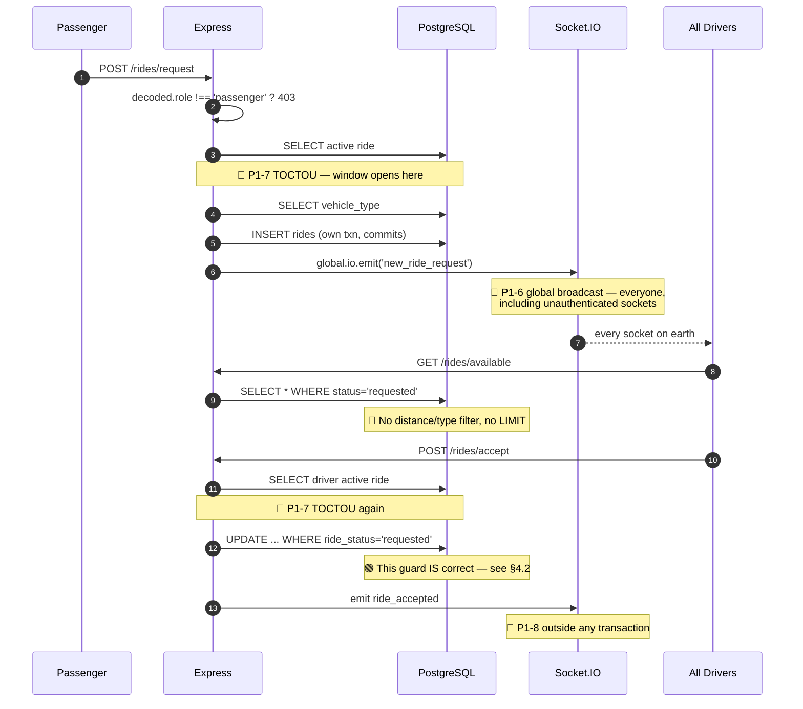

The `UPDATE ... WHERE ride_status='requested' RETURNING` at `rideAccept.js:29-34` is genuinely correct concurrency control — it is single-statement optimistic locking and it does prevent two drivers from accepting the same ride. Phase 3 keeps this pattern and builds on it.

#### Trace B — Complete → Fare → Payment

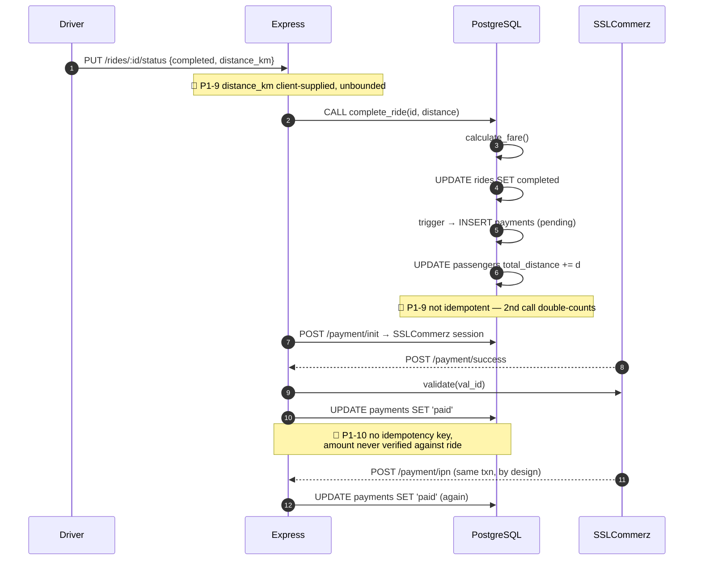

#### Trace C — Socket fan-out (the security hole)

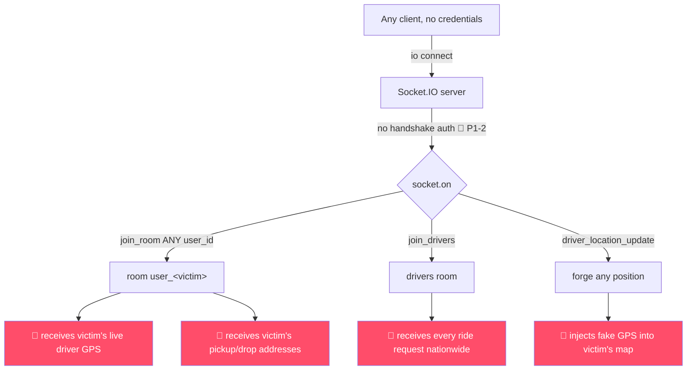

---

## §2 The "Over-the-Edge" Target Architecture

### 2.1 Design principles

Six rules that every decision in §3–§5 answers to.

1. **The database is the last line of defense.** Every invariant that *can* be a constraint *is* a constraint. Application checks are a UX affordance that produce nice error messages; the constraint is what makes the invariant true. This is the direct answer to P1-7.
2. **Make illegal states unrepresentable.** Enums over free-text status. Partial unique indexes over `SELECT`-then-`INSERT`. `CHECK` constraints over hoping.
3. **Never let an event escape a rolled-back transaction.** Side effects are written to an outbox inside the transaction and relayed after commit.
4. **Every write is idempotent or key-guarded.** Networks retry. Gateways double-fire. Users double-tap. Correctness cannot assume exactly-once delivery.
5. **Separate hot path from cold path.** Driver positions update every few seconds and are read constantly — that lives in Valkey. Durable history, analytics, and geofences live in PostGIS. Do not make one system do both.
6. **Observable by construction.** If you cannot see a p99, you cannot claim a latency target. Instrumentation goes in with the feature, not after.

### 2.2 Container architecture

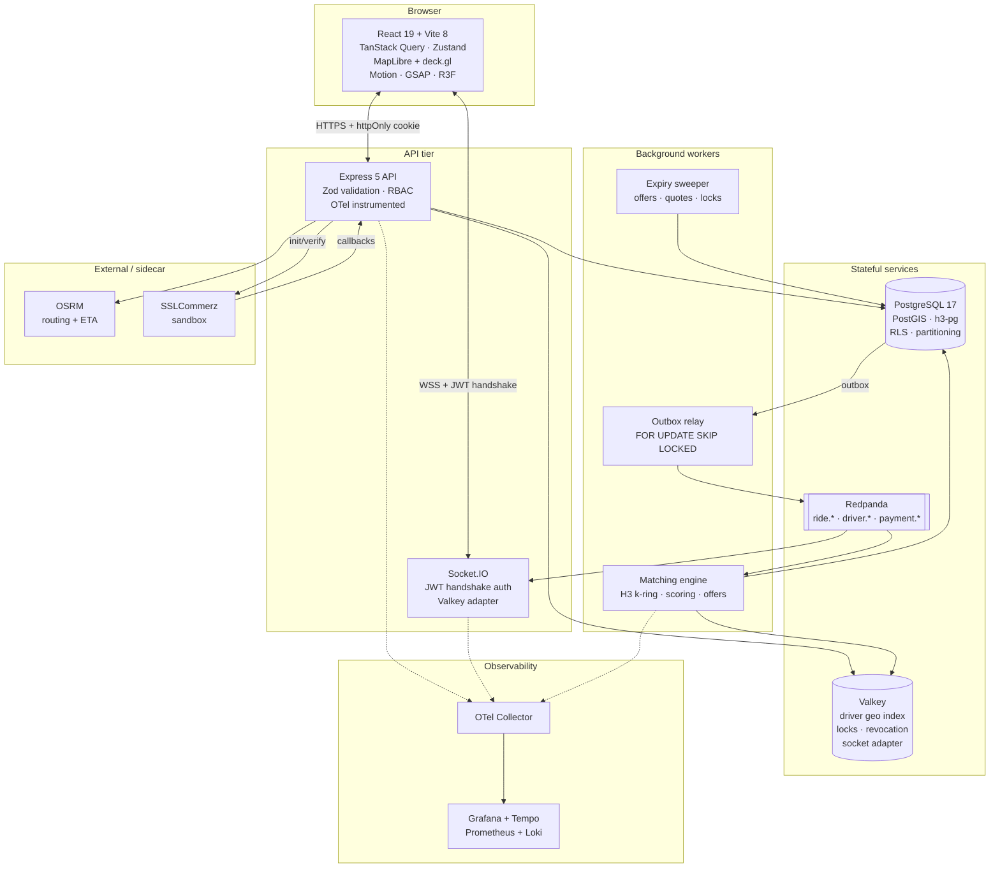

Everything in this diagram runs in one `docker compose up` on a laptop.

### 2.3 The ride lifecycle as an explicit state machine

Today `ride_status` is a `VARCHAR(20)` whose legal values appear only in a comment. The target makes the machine explicit and enforces it in the database.

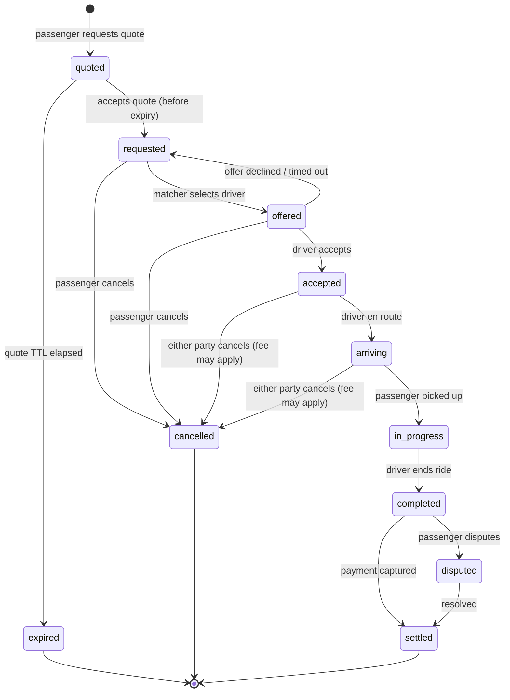

Enforced by three mechanisms working together:

1. A PostgreSQL `ENUM` type — misspellings become an error, not a row.
2. A `BEFORE UPDATE` trigger validating each transition against an explicit allowed-transitions table.
3. Every transition appends to `ride_events` (append-only) so the full history is reconstructible.

### 2.4 Target schema v2

Illustrative DDL — final form lands as `node-pg-migrate` migrations in Phase 2.

```sql
-- ═══ Extensions ═══
CREATE EXTENSION IF NOT EXISTS postgis;
CREATE EXTENSION IF NOT EXISTS pgcrypto;      -- gen_random_uuid()
CREATE EXTENSION IF NOT EXISTS pg_stat_statements;
CREATE EXTENSION IF NOT EXISTS h3;            -- h3-pg
CREATE EXTENSION IF NOT EXISTS h3_postgis;

-- ═══ Enums: illegal states become unrepresentable ═══
CREATE TYPE ride_status AS ENUM (
  'quoted','requested','offered','accepted','arriving',
  'in_progress','completed','settled','cancelled','expired','disputed'
);
CREATE TYPE payment_status AS ENUM (
  'pending','authorized','paid','failed','cancelled','refunded','disputed'
);
CREATE TYPE payment_method  AS ENUM ('cash','sslcommerz','wallet');
CREATE TYPE driver_status   AS ENUM ('pending','active','suspended','offline','banned');
CREATE TYPE user_role       AS ENUM ('passenger','driver','admin');

-- ═══ Users ═══
ALTER TABLE users
  ADD COLUMN password_hash_algo TEXT NOT NULL DEFAULT 'sha256',  -- 'argon2id' after migration
  ADD COLUMN is_active   BOOLEAN NOT NULL DEFAULT TRUE,
  ADD COLUMN deleted_at  TIMESTAMPTZ,
  ADD COLUMN updated_at  TIMESTAMPTZ NOT NULL DEFAULT now(),
  ADD COLUMN email_verified_at TIMESTAMPTZ,
  ADD COLUMN failed_login_count INT NOT NULL DEFAULT 0,
  ADD COLUMN locked_until TIMESTAMPTZ;

CREATE UNIQUE INDEX users_email_active_uq
  ON users (lower(email)) WHERE deleted_at IS NULL;

-- ═══ Rides ═══
ALTER TABLE rides
  ALTER COLUMN ride_status TYPE ride_status USING ride_status::ride_status,
  ADD COLUMN pickup_geog  geography(Point,4326),
  ADD COLUMN drop_geog    geography(Point,4326),
  ADD COLUMN pickup_h3_r8 h3index,
  ADD COLUMN drop_h3_r8   h3index,
  ADD COLUMN fare_minor   BIGINT,          -- poisha. never float.
  ADD COLUMN currency     CHAR(3) NOT NULL DEFAULT 'BDT',
  ADD COLUMN quoted_fare_minor BIGINT,
  ADD COLUMN surge_multiplier NUMERIC(4,2) NOT NULL DEFAULT 1.00,
  ADD COLUMN route_polyline TEXT,
  ADD COLUMN eta_seconds  INT,
  ADD COLUMN version      INT NOT NULL DEFAULT 0,   -- optimistic concurrency
  ADD COLUMN updated_at   TIMESTAMPTZ NOT NULL DEFAULT now(),
  ADD COLUMN cancelled_by INT REFERENCES users(user_id),
  ADD COLUMN cancel_reason TEXT;

ALTER TABLE rides
  ADD CONSTRAINT rides_distance_sane
    CHECK (distance_km IS NULL OR (distance_km > 0 AND distance_km <= 500)),
  ADD CONSTRAINT rides_fare_nonneg
    CHECK (fare_minor IS NULL OR fare_minor >= 0),
  ADD CONSTRAINT rides_driver_required_after_accept
    CHECK (ride_status IN ('quoted','requested','offered','cancelled','expired')
           OR driver_id IS NOT NULL);

-- ★ THE INVARIANT THAT KILLS P1-7 ★
-- At most one non-terminal ride per passenger, enforced by the database.
CREATE UNIQUE INDEX rides_one_active_per_passenger
  ON rides (passenger_id)
  WHERE ride_status IN ('quoted','requested','offered','accepted','arriving','in_progress');

CREATE UNIQUE INDEX rides_one_active_per_driver
  ON rides (driver_id)
  WHERE driver_id IS NOT NULL
    AND ride_status IN ('offered','accepted','arriving','in_progress');

CREATE INDEX rides_open_requests_idx
  ON rides (vehicle_type_id, requested_at)
  WHERE ride_status = 'requested';
CREATE INDEX rides_pickup_geog_gix ON rides USING GIST (pickup_geog);
CREATE INDEX rides_pickup_h3_idx   ON rides (pickup_h3_r8);

-- ═══ Driver live position — the table that does not exist today ═══
CREATE UNLOGGED TABLE driver_locations (
  driver_id     INT PRIMARY KEY REFERENCES drivers(user_id),
  geog          geography(Point,4326) NOT NULL,
  h3_r8         h3index NOT NULL,
  h3_r9         h3index NOT NULL,
  heading_deg   SMALLINT,
  speed_kmh     NUMERIC(5,2),
  accuracy_m    NUMERIC(6,2),
  is_available  BOOLEAN NOT NULL DEFAULT TRUE,
  updated_at    TIMESTAMPTZ NOT NULL DEFAULT now()
);
-- UNLOGGED: no WAL. Losing this on crash is fine — drivers re-ping in seconds.
-- Order of magnitude faster writes, which is the whole point.
CREATE INDEX driver_locations_h3_avail_idx
  ON driver_locations (h3_r8) WHERE is_available;
CREATE INDEX driver_locations_geog_gix ON driver_locations USING GIST (geog);

-- ═══ Dispatch offers — time-boxed, exclusive ═══
CREATE TABLE ride_offers (
  offer_id    BIGSERIAL PRIMARY KEY,
  ride_id     INT NOT NULL REFERENCES rides(ride_id),
  driver_id   INT NOT NULL REFERENCES drivers(user_id),
  rank        SMALLINT NOT NULL,
  score       NUMERIC(8,4) NOT NULL,
  offered_at  TIMESTAMPTZ NOT NULL DEFAULT now(),
  expires_at  TIMESTAMPTZ NOT NULL,
  responded_at TIMESTAMPTZ,
  outcome     TEXT CHECK (outcome IN ('accepted','declined','expired','superseded'))
);
CREATE UNIQUE INDEX ride_offers_one_live_per_ride
  ON ride_offers (ride_id) WHERE outcome IS NULL;
CREATE UNIQUE INDEX ride_offers_one_live_per_driver
  ON ride_offers (driver_id) WHERE outcome IS NULL;

-- ═══ Append-only audit log ═══
CREATE TABLE ride_events (
  event_id    BIGSERIAL PRIMARY KEY,
  ride_id     INT NOT NULL REFERENCES rides(ride_id),
  from_status ride_status,
  to_status   ride_status NOT NULL,
  actor_id    INT REFERENCES users(user_id),
  actor_role  user_role,
  payload     JSONB NOT NULL DEFAULT '{}',
  occurred_at TIMESTAMPTZ NOT NULL DEFAULT now()
);
CREATE INDEX ride_events_ride_idx ON ride_events (ride_id, occurred_at);
REVOKE UPDATE, DELETE ON ride_events FROM PUBLIC;   -- append-only, enforced

-- ═══ Transactional outbox ═══
CREATE TABLE outbox (
  id            BIGSERIAL PRIMARY KEY,
  aggregate_type TEXT NOT NULL,
  aggregate_id  TEXT NOT NULL,
  event_type    TEXT NOT NULL,
  payload       JSONB NOT NULL,
  created_at    TIMESTAMPTZ NOT NULL DEFAULT now(),
  published_at  TIMESTAMPTZ,
  attempts      INT NOT NULL DEFAULT 0,
  last_error    TEXT
);
CREATE INDEX outbox_unpublished_idx ON outbox (created_at) WHERE published_at IS NULL;

-- ═══ Idempotency ═══
CREATE TABLE idempotency_keys (
  key           TEXT PRIMARY KEY,
  scope         TEXT NOT NULL,
  request_hash  TEXT NOT NULL,
  response_code INT,
  response_body JSONB,
  created_at    TIMESTAMPTZ NOT NULL DEFAULT now(),
  expires_at    TIMESTAMPTZ NOT NULL
);

-- ═══ Payments, corrected ═══
ALTER TABLE payments
  ALTER COLUMN payment_status TYPE payment_status USING payment_status::payment_status,
  ADD COLUMN amount_minor    BIGINT NOT NULL,
  ADD COLUMN currency        CHAR(3) NOT NULL DEFAULT 'BDT',
  ADD COLUMN gateway_amount_minor BIGINT,      -- what SSLCommerz says
  ADD COLUMN idempotency_key TEXT,
  ADD COLUMN verified_at     TIMESTAMPTZ,
  ADD COLUMN raw_gateway_response JSONB;
ALTER TABLE payments
  ADD CONSTRAINT payments_amount_matches
    CHECK (gateway_amount_minor IS NULL OR gateway_amount_minor = amount_minor);

-- ═══ Ratings, corrected ═══
DROP TABLE ratings;
CREATE TABLE ratings (
  rating_id    BIGSERIAL PRIMARY KEY,
  ride_id      INT NOT NULL REFERENCES rides(ride_id),
  rater_id     INT NOT NULL REFERENCES users(user_id),
  ratee_id     INT NOT NULL REFERENCES users(user_id),
  rating_value SMALLINT NOT NULL CHECK (rating_value BETWEEN 1 AND 5),
  comment      TEXT,
  created_at   TIMESTAMPTZ NOT NULL DEFAULT now(),
  CONSTRAINT ratings_no_self CHECK (rater_id <> ratee_id)
);
-- Each participant rates each ride exactly once. Both can rate.
CREATE UNIQUE INDEX ratings_one_per_rater_per_ride ON ratings (ride_id, rater_id);

-- Denormalized running aggregate — no full scan per rating (fixes P1-13)
ALTER TABLE drivers
  ADD COLUMN rating_count INT NOT NULL DEFAULT 0,
  ADD COLUMN rating_sum   BIGINT NOT NULL DEFAULT 0,
  ADD COLUMN status_v2    driver_status NOT NULL DEFAULT 'pending';
-- rating_average becomes GENERATED: always consistent, never stale
ALTER TABLE drivers DROP COLUMN rating_average;
ALTER TABLE drivers ADD COLUMN rating_average NUMERIC(3,2)
  GENERATED ALWAYS AS (
    CASE WHEN rating_count = 0 THEN NULL
         ELSE ROUND(rating_sum::numeric / rating_count, 2) END
  ) STORED;

-- ═══ Location logs: partitioned by month ═══
CREATE TABLE location_logs_v2 (
  log_id      BIGSERIAL,
  ride_id     INT NOT NULL,
  geog        geography(Point,4326) NOT NULL,
  speed_kmh   NUMERIC(5,2),
  recorded_at TIMESTAMPTZ NOT NULL DEFAULT now()
) PARTITION BY RANGE (recorded_at);
CREATE TABLE location_logs_2026_07 PARTITION OF location_logs_v2
  FOR VALUES FROM ('2026-07-01') TO ('2026-08-01');
-- Dropping a month is DROP TABLE (instant), not DELETE (hours + bloat).

-- ═══ Surge, computed per H3 cell ═══
CREATE TABLE surge_cells (
  h3_r8        h3index PRIMARY KEY,
  demand_count INT NOT NULL DEFAULT 0,
  supply_count INT NOT NULL DEFAULT 0,
  multiplier   NUMERIC(4,2) NOT NULL DEFAULT 1.00 CHECK (multiplier BETWEEN 1.00 AND 3.00),
  computed_at  TIMESTAMPTZ NOT NULL DEFAULT now()
);

-- ═══ Fare quotes: price is promised before the ride, not discovered after ═══
CREATE TABLE fare_quotes (
  quote_id       UUID PRIMARY KEY DEFAULT gen_random_uuid(),
  passenger_id   INT NOT NULL REFERENCES passengers(user_id),
  vehicle_type_id INT NOT NULL REFERENCES vehicle_types(vehicle_type_id),
  pickup_geog    geography(Point,4326) NOT NULL,
  drop_geog      geography(Point,4326) NOT NULL,
  distance_km    NUMERIC(10,2) NOT NULL,
  eta_seconds    INT NOT NULL,
  base_minor     BIGINT NOT NULL,
  surge_multiplier NUMERIC(4,2) NOT NULL,
  total_minor    BIGINT NOT NULL,
  signature      TEXT NOT NULL,      -- HMAC. client cannot tamper with the price.
  created_at     TIMESTAMPTZ NOT NULL DEFAULT now(),
  expires_at     TIMESTAMPTZ NOT NULL,
  consumed_at    TIMESTAMPTZ
);

-- ═══ Refresh tokens (replaces the in-memory Map) ═══
CREATE TABLE refresh_tokens (
  jti         UUID PRIMARY KEY,
  user_id     INT NOT NULL REFERENCES users(user_id),
  family_id   UUID NOT NULL,          -- rotation lineage: reuse detection
  issued_at   TIMESTAMPTZ NOT NULL DEFAULT now(),
  expires_at  TIMESTAMPTZ NOT NULL,
  revoked_at  TIMESTAMPTZ,
  replaced_by UUID REFERENCES refresh_tokens(jti),
  user_agent  TEXT,
  ip          INET
);
CREATE INDEX refresh_tokens_family_idx ON refresh_tokens (family_id);
```

### 2.5 Entity relationships

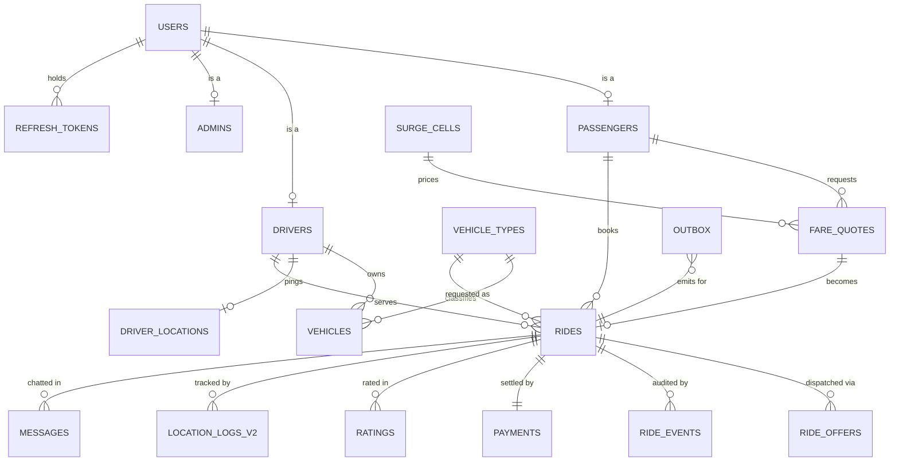

### 2.6 Docker Compose topology

One command brings up the entire stack. Sketch:

| Service | Image | Purpose | Approx. RAM |
|---|---|---|---|
| `postgres` | `postgis/postgis:17-3.5` + h3-pg | Primary datastore, PostGIS, H3, RLS, partitioning | 512 MB |
| `valkey` | `valkey/valkey:8-alpine` | Driver geo index, distributed locks, token revocation, Socket.IO adapter | 128 MB |
| `redpanda` | `redpandadata/redpanda:latest` | Kafka-API event log, single binary, no JVM | 512 MB |
| `redpanda-console` | `redpandadata/console` | Topic/message browser UI | 128 MB |
| `osrm` | `osrm/osrm-backend` + Bangladesh OSM extract | Real road routing, distance, ETA, polylines | 512 MB |
| `otel-lgtm` | `grafana/otel-lgtm` | Grafana + Tempo + Prometheus + Loki in one container | 768 MB |
| `api` | local Dockerfile | Express API | 256 MB |
| `worker` | local Dockerfile | Outbox relay + matcher + sweeper | 256 MB |
| `web` | local Dockerfile | Vite dev server / static build | 256 MB |

**≈3.3 GB total** — comfortable on a 8 GB laptop, tight but workable on 8 GB with a browser open. Profiles let you run a `core` subset (`postgres` + `valkey` + `api` + `web`) for day-to-day work and the full stack only when exercising Phases 6–7.

---

## §3 The Multi-Layered Tool Stack Matrix

Every recommendation below comes from live web research conducted 2026-07-28, not from memory. Sources are listed in [§6.3](#63-sources). Where a tool you named as an example is *not* the pick, the reason is stated explicitly — you asked for the best available, not for your examples to be rubber-stamped.

**Legend:** ★ = our pick · ◆ = strong alternative · ○ = considered and rejected

### Layer 0 — Repository Intelligence

| Tool | Verdict | Trade-off |
|---|---|---|
| **graphify** (installed) | ★ | Already produced `graphify-out/` — 278 nodes, community detection, god-node ranking, hyperedges. Re-run at the end of each phase to *watch the architecture change*. The `query()` 52-edge finding in §1.2 came directly from it. |
| **Sourcegraph / ast-grep** | ◆ | `ast-grep` is excellent for structural codemods (`ast-grep --pattern 'if (!$D \|\| $D.role !== $R) { $$$ }'` would find all 6 copies of P1-5 instantly). Add it in Phase 5 as a *refactoring* tool, not a mapping tool. |
| **OpenHands / Sweep / Aider repo-map** | ○ | Autonomous PR agents. Directly opposed to D3 (human-in-the-loop): they generate large changes you did not watch being made. |

> **Note:** re-running graphify after each phase is a *deliverable*, not a nicety. The `query()` node dropping from 52 edges toward ~8 (service layer) is objective proof the refactor worked.

### Layer 1 — Runtime & API Framework

| Option | Verdict | Trade-off |
|---|---|---|
| **Express 5** (current) | ★ | Already here, already v5 (native async error propagation — a genuinely important upgrade). D3 says strangler, not rewrite. Effort goes to *architecture* (service layer, DI, validation), not to re-plumbing HTTP. Research is explicit: "avoid choosing a framework based solely on benchmarks; a 3x difference rarely matters if your bottleneck is database queries" — and here it certainly is. |
| **Fastify 5** | ◆ | ~3x Express throughput, built-in JSON-schema validation, first-class plugin encapsulation. Genuinely tempting. Rejected because migrating 28 routes buys throughput we are not bottlenecked on, at the cost of a phase we would rather spend on §4. |
| **NestJS / Encore** | ○ | NestJS's value is DI + enforced structure for large teams — and it is TypeScript-first, which D2 excludes. Encore is compelling for multi-service, but we are deliberately a modular monolith. |

**What we adopt from them anyway:** Fastify's schema-first validation discipline via Zod, and NestJS's layering (`route → middleware → controller → service → repository`) implemented by hand. You get the benefit and see the wiring.

### Layer 2 — Data Access & Migrations

| Option | Verdict | Trade-off |
|---|---|---|
| **`node-pg-migrate` + hand-written SQL + Zod** | ★ | Timestamped, ordered, reversible migrations with up/down. SQL stays fully visible — non-negotiable when the point is understanding `SKIP LOCKED` and PostGIS. Zod validates at I/O boundaries where JS has no types. |
| **Drizzle ORM** | ◆ | Research is unambiguous that Drizzle is the 2026 pick for *new TypeScript* projects — ~5 KB core, overtook Prisma in downloads, SQL-shaped API. **Excluded by D2**, and honestly correct to exclude: it would abstract exactly the queries this project is about. Revisit only if you ever reverse D2. |
| **Prisma** | ○ | ~40 KB client + ~50 MB binary, `prisma generate` step, and the heaviest abstraction of the three. Wrong on every axis for us. |

Supporting picks: **`pg`** stays as the driver (already there, mature). **`pgTyped`** noted as an optional Phase 9 nicety — it generates JSDoc types *from* your SQL, giving type inference without hiding queries.

### Layer 3 — Database Engine & Extensions

| Component | Pick | Why |
|---|---|---|
| **PostgreSQL 17** | ★ | Already the DB. 17 brings better `VACUUM` memory management and improved partition pruning — both directly relevant to `location_logs`. |
| **PostGIS 3.5** | ★ | `geography(Point,4326)` with true spheroidal distance, GiST indexing, `ST_DWithin`. The durable/analytical half of §4.7. |
| **h3-pg** | ★ | Uber's H3 as native SQL types + functions. Lets us compute cells in the DB *and* in Node (`h3-js`) with identical results — essential for the hybrid design. |
| **`pg_stat_statements`** | ★ | Query-level p99. You cannot optimize what you cannot rank. |
| TimescaleDB | ◆ | Genuinely better for `location_logs` (auto-partitioning, compression, continuous aggregates). Rejected for D1: it constrains the base image and adds concepts. Native declarative partitioning teaches the underlying mechanic, which is the point. |

### Layer 4 — Cache, Hot State & Distributed Locks

| Option | Verdict | Trade-off |
|---|---|---|
| **Valkey 8** | ★ | **BSD-3-Clause.** Redis 8 re-added an OSI-approved licence but it is **AGPLv3** — copyleft obligations you do not want anywhere near a project you may publish. Valkey is API-identical to Redis 7.x (migration is a connection-string change), Linux-Foundation governed, and backed by AWS/Google/Oracle. Ships `GEOADD`/`GEOSEARCH`, Lua scripting, and pub/sub — everything we need. |
| **Redis 8** | ◆ | Slightly ahead on some newer data types. AGPL is the dealbreaker. |
| **Dragonfly** | ○ | Fastest of the three by a distance, but **BSL-licensed** (no commercial managed service) and its value is escaping Redis's single-threaded ceiling — a ceiling we are nowhere near. Research verdict: "earns its place only if you've hit Redis's single-threaded ceiling." |

Four jobs in this project: H3-bucketed driver index (hot geo), distributed locks ([§4.5](#45-distributed-locks-and-when-not-to-use-them)), JWT `jti` revocation (replaces P1-14's in-memory `Map`), and the Socket.IO adapter for multi-process fan-out.

### Layer 5 — Event Streaming

| Option | Verdict | Trade-off |
|---|---|---|
| **Redpanda** | ★ | Kafka API, single C++ binary, **no JVM and no ZooKeeper/KRaft ceremony**. Research: up to 2M small msg/s per broker, p99 <5 ms under load; "Kafka compatibility without the operational burden." Under D1 this is the only Kafka-grade option that is honestly laptop-viable. Redpanda Console gives you a topic browser to *see* your events — invaluable while learning. |
| **NATS JetStream** | ◆ | Lighter still (<3 ms median at 500K msg/s), lovely ergonomics. Rejected because the Kafka API is the industry lingua franca — learning it transfers; learning NATS subjects transfers less. |
| **Apache Kafka** | ○ | The real thing, and the ecosystem is unmatched. JVM + broker tuning is a multi-gigabyte, multi-day tax that buys us nothing at laptop scale. |

Topics: `ride.requested` · `ride.offered` · `ride.accepted` · `ride.completed` · `driver.location` · `payment.settled`. Partitioned by `ride_id` so per-ride ordering is guaranteed.

### Layer 6 — Workflow Orchestration

> **Direct answer to your brief:** you named **LangGraph** and **n8n** as candidates for "API orchestration." Both are excellent — at other problems. LangGraph orchestrates *LLM agent* graphs; n8n is a low-code integration automation tool. Neither is a fit for orchestrating a money-handling ride lifecycle with compensating transactions. The correct category is **durable execution**.

| Option | Verdict | Trade-off |
|---|---|---|
| **Postgres-native saga + outbox** | ★ | Under D1/D3, this is the honest answer. State lives in `rides.ride_status` + `ride_events`; compensation is explicit code; the outbox guarantees delivery. Zero new infrastructure, and **you understand every moving part** — which is exactly the point. |
| **Restate** | ◆ | Single binary, HTTP-native, journal/replay like Temporal at a fraction of the footprint. Research positions it precisely for "serverless and edge where Temporal's operational footprint is overkill." The one to reach for if sagas start to hurt — flagged as **optional Phase 3 depth**. |
| **Temporal** | ○ | The heavyweight; deterministic replay, superb. You run a cluster. Research: "far more operationally involved." Wrong weight class for a laptop. |
| LangGraph / n8n | ○ | Wrong problem domain, as above. |

### Layer 7 — Geospatial Indexing (the centerpiece)

This is where the research most changed the design.

| Option | Verdict | Trade-off |
|---|---|---|
| **H3 in Valkey (hot) + PostGIS (durable)** | ★ | Research is explicit that PostGIS's R-trees "struggle" with the continuous high-frequency writes of moving drivers, while Uber and Grab find nearest drivers **in under 100 ms** using H3 at resolution 8 (~0.74 km² cells) by scanning only the 7 cells around the rider. So: **hot path in Valkey keyed by H3 cell; durable geometry, geofences, and analytics in PostGIS.** Right tool per access pattern. |
| **PostGIS only** | ◆ | Far simpler — one system, `ST_DWithin` + GiST, transactional. Perfectly adequate at term-project scale. **We build this first in Phase 4 and benchmark it**, because the crossover point is a *measurement*, not an opinion. |
| **S2** | ○ | Research: "for most use cases H3 is the better choice; the main reason to reach for S2 is BigQuery interop." We have no BigQuery. |
| Plain geohash | ○ | Worth *understanding* (§4.7 explains it) but the string-prefix boundary problem is real and H3 solves it. |

**Why hexagons:** every H3 neighbour's centre is equidistant from the origin's centre. With squares you have 4 edge-neighbours at distance *d* and 4 corner-neighbours at *d√2* — so "one ring out" means two different distances and your radius search is systematically wrong. Hexagons have exactly 6 neighbours, all equidistant. Fully unpacked at the Phase 4 checkpoint.

### Layer 8 — Routing & ETA

| Option | Verdict | Trade-off |
|---|---|---|
| **OSRM (self-hosted, Bangladesh OSM extract)** | ★ | Actual road-network routing, sub-ms queries after preprocessing, returns distance + duration + encoded polyline. Free, offline, Docker-native. Replaces the fiction that `distance_km` is client-supplied (P1-9). |
| **Valhalla** | ◆ | More capable (time-dependent costing, better multimodal, isochrones) at higher setup and memory cost. Upgrade path if we want traffic-aware ETA. |
| Google / Mapbox Directions API | ○ | Best quality, but paid, rate-limited, requires network, and leaks every passenger's origin-destination pair to a third party. Fails D1. |

### Layer 9 — Realtime Transport

| Option | Verdict | Trade-off |
|---|---|---|
| **Socket.IO 4.8 + `@socket.io/redis-adapter` on Valkey** | ★ | Already integrated. Gives auto-reconnect, room semantics, and transport fallback for free. The fixes it needs are *authentication* (P1-2) and the Valkey adapter for multi-process — not replacement. |
| Raw `ws` + custom protocol | ◆ | Leaner and faster, but you reimplement reconnect, heartbeat, rooms, and backpressure. Not a good use of a phase. |
| SSE + POST | ○ | Simpler, but half-duplex. Driver location updates flow *upward* constantly — the wrong shape. |

Critical redesign: Socket.IO becomes a **projection layer**, never a source of truth. Events originate in Postgres (outbox) → Redpanda → fan-out. That is what makes P1-8 structurally impossible.

### Layer 10 — Auth & Cryptography

| Concern | Pick | Notes |
|---|---|---|
| Password hashing | **`@node-rs/argon2`** (Argon2id) | Rust-backed, no node-gyp pain on Windows. Memory-hard — the property SHA-256 fundamentally lacks. Transparent rehash-on-login migrates existing users with no forced reset. |
| Alternative | `bcrypt` ◆ | Battle-tested, but 72-byte input truncation and not memory-hard. Argon2id is the current OWASP recommendation. |
| Tokens | Access JWT (15 min, in memory) + refresh (rotating, `httpOnly` cookie) | Kills P1-3. Family-based reuse detection ([§4.9](#49-refresh-token-rotation-with-reuse-detection)). |
| Revocation | Valkey `jti` set, TTL = token TTL | Kills P1-14. Survives restarts, works across processes. |
| Headers / limits | `helmet`, `express-rate-limit` (Valkey store), `express-slow-down` on `/login` | Kills P1-4. |
| Validation | **Zod** | One schema per route: `body`, `params`, `query`. Replaces ~200 lines of hand-rolled `if (!x)`. Works perfectly in plain JS. |

### Layer 11 — Observability

| Option | Verdict | Trade-off |
|---|---|---|
| **OTel SDK → `grafana/otel-lgtm`** | ★ | **One container** = Grafana + Tempo (traces) + Prometheus (metrics) + Loki (logs), pre-wired. Under D1 this is decisive. Auto-instrumentation covers `http`, `express`, `pg`, `socket.io`, `ioredis`, `kafkajs` — you get end-to-end traces from HTTP request through SQL with near-zero code. Tempo's TraceQL is genuinely good for "show me accepts where the SQL took >100 ms." |
| **SigNoz** | ◆ | Excellent single-pane UX, natively OTel. Drags in ClickHouse — too heavy for a laptop running 8 other containers. |
| **Jaeger v2** | ○ | Now OTel-cored and fine, but traces only. We want RED metrics and logs correlated to the same trace ID. |

The key architectural point: **the OTel Collector decouples app from backend.** Swap the entire backend by editing one YAML file, changing zero application code.

### Layer 12 — Load, Stress & Chaos Testing

| Option | Verdict | Trade-off |
|---|---|---|
| **k6** (HTTP/CI) + **Artillery** (Socket.IO) | ★ | Deliberately both. Research: "Artillery supports Socket.IO natively; k6 handles raw WebSockets via its `ws` module" — and we run Socket.IO, not raw WS. k6 is the single-Go-binary CI workhorse with native Grafana output; Artillery covers the realtime layer k6 can't reach properly. |
| Gatling / JMeter | ○ | JVM-heavy, GUI-oriented, poor CI ergonomics. |
| **Toxiproxy** | ★ (chaos) | Inject latency, bandwidth limits, and connection drops between API and Postgres/Valkey/Redpanda. This is how we *prove* the retry logic in §4.3 actually works instead of hoping. |

### Layer 13 — Testing

| Layer | Pick | Notes |
|---|---|---|
| Unit | **Vitest** | Vite-native (frontend already on Vite 8), Jest-compatible API, dramatically faster. |
| Integration | **Testcontainers** + real Postgres | Non-negotiable for this project. `FOR UPDATE SKIP LOCKED`, partial unique indexes, and isolation-level behaviour **cannot be mocked** — mocking them tests your mock. Spin a real container per suite. |
| HTTP | **Supertest** | Route-level assertions against the real Express app. |
| E2E | **Playwright** | Full ride lifecycle across two browser contexts (passenger + driver) simultaneously — the only honest way to test a two-sided marketplace. |
| Concurrency | Custom harness | N parallel clients hammering one ride; assert **exactly one** wins. See [§4.10](#410-proving-it-the-concurrency-test-harness). |

### Layer 14 — Design-to-Code Pipeline

Multi-stage, per your brief. The critical rule: **AI generates the visual shell, you own the logic.**

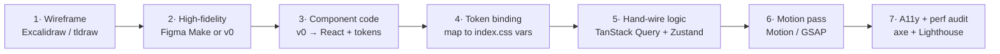

| Stage | Pick | Alternative | Trade-off |
|---|---|---|---|
| Wireframe | **tldraw** ★ | Excalidraw ◆ | Both free; tldraw exports cleaner for AI ingestion. |
| Hi-fi design | **v0** ★ | Figma Make ◆ | Research: v0 "generates React components styled with shadcn/ui" and is the pick "for aesthetic apps"; Figma Make is "best for high-fidelity mockups faithful to mobile UI conventions." v0 wins because it emits code we can actually integrate. |
| Full-app gen | — | Lovable / Bolt ○ | Research flags "real limits on complex business logic, long-term maintenance." Directly contradicts D3 and the human-in-the-loop mandate. **Explicitly rejected.** |

### Layer 15 — Frontend Architecture

| Concern | Pick | Replaces / Notes |
|---|---|---|
| Server state | **TanStack Query v5** | Kills P2-20 across all 14 pages. Caching, dedup, background refetch, stale-while-revalidate, optimistic updates, and automatic invalidation on socket events. The single highest-leverage frontend change. |
| Client state | **Zustand** | ~1 KB, no provider pyramid. `AuthContext` + `SocketContext` collapse into two small stores. |
| Routing | react-router-dom 7 (keep) | Already current. Add lazy routes + error boundaries (P2-27). |
| Forms | **React Hook Form + Zod** | Same Zod schemas as the API — one definition, validated on both sides. |
| Styling | **Tailwind v4** | v4's CSS-first `@theme` consumes the *existing* `index.css` custom properties directly. We keep your design language, gain utilities and scoping, retire the 1,016-line monolith (P2-23). |

### Layer 16 — Motion, 3D & Map Rendering

| Concern | Pick | Trade-off |
|---|---|---|
| UI motion | **Motion** (ex-Framer Motion) ★ | Research: ~4.6 KB via `LazyMotion` + `m`, vs GSAP core ~23 KB. Declarative, React-level, ideal for enter/exit, layout shifts, gestures. |
| Timeline / scroll | **GSAP** ★ | Research: GSAP for "complex sequences, scroll animations, text reveals, award-level sites," and a measured 60fps vs 45–50fps advantage on a 40-element stagger where React re-renders. **Both, deliberately** — research confirms they operate at different levels (imperative/DOM vs declarative/React) and "don't conflict." GSAP owns the landing hero; Motion owns in-app transitions. |
| 3D | **React Three Fiber + drei** ★ | One showcase scene (animated 3D Dhaka with live ride arcs). Scoped tightly and lazy-loaded — spectacular, not gratuitous. Research note: Motion↔R3F needs community adapters and fights React-DOM assumptions; **GSAP drives R3F objects natively** (`gsap.to(mesh.position, …)`). So GSAP handles 3D motion. |
| Base map | **MapLibre GL JS** ★ | Research: "the right default for most new projects" — Mapbox-quality vector rendering, no pricing or licensing restrictions, API near-identical to Mapbox GL JS v1. Replaces Leaflet (P2-24). |
| Vehicle layer | **deck.gl** ★ | Research: "the right choice when you have real-time vehicle tracking… processes data on the GPU, handling datasets that would crash DOM-based or Canvas-based renderers," and integrates seamlessly with MapLibre. `TripsLayer` + `ScatterplotLayer` for live drivers, `ArcLayer` for the admin view. |
| Mapbox GL JS | ○ | Same tech, proprietary tiles and pricing. No reason. |

### Layer 17 — Developer Environment

| Concern | Pick | Notes |
|---|---|---|
| Orchestration | **Docker Compose** (profiles) | D1. `core` profile for daily work, `full` for Phases 6–7. |
| Package mgmt | **npm workspaces** | Fixes P2-12 — one lockfile, one `npm install`, shared scripts. Minimal change from where you are. |
| Task running | **`npm-run-all`** or a `Makefile` | `make up`, `make migrate`, `make seed`, `make load-test`. |
| Lint / format | **ESLint 9 flat config** (already on frontend) + **Prettier** | Extend the existing flat config to the backend, which currently has none. |
| Git hygiene | **Husky + lint-staged + `git-secrets`** | `git-secrets` blocks a P0-3 recurrence at commit time — the fix must be structural, not a promise. |

---

## §4 Deep Backend/Database Logic

The technical heart. Every blueprint here is runnable and maps to a specific defect from §1.

### 4.1 The transaction problem

**Fixes:** P1-6 · **Phase:** 1 · **Blocks:** most of Phase 3

Today's `query()` (`db.js:25-52`) commits per statement on a fresh connection, so multi-statement atomicity is unreachable. The replacement:

```js
// database/db.js — target shape
const SERIALIZATION_FAILURE = '40001';
const DEADLOCK_DETECTED     = '40P01';

/**
 * Runs `fn` inside one transaction on one client.
 * Retries automatically on serialization failure / deadlock with jittered backoff.
 *
 * @param {(client: import('pg').PoolClient) => Promise<T>} fn
 * @param {{ isolation?: 'READ COMMITTED'|'REPEATABLE READ'|'SERIALIZABLE',
 *           readOnly?: boolean, maxRetries?: number, actorId?: number }} [opts]
 * @returns {Promise<T>}
 * @template T
 */
async function withTransaction(fn, opts = {}) {
  const { isolation = 'READ COMMITTED', readOnly = false,
          maxRetries = 3, actorId = null } = opts;

  for (let attempt = 0; ; attempt++) {
    const client = await pool.connect();
    try {
      await client.query(`BEGIN ISOLATION LEVEL ${isolation}${readOnly ? ' READ ONLY' : ''}`);

      // Bind the actor for Row-Level Security (§4.8). LOCAL = scoped to this txn.
      if (actorId != null) {
        await client.query('SELECT set_config($1,$2,true)',
                           ['app.current_user_id', String(actorId)]);
      }

      const result = await fn(client);
      await client.query('COMMIT');
      return result;

    } catch (err) {
      await client.query('ROLLBACK').catch(() => {});

      const retryable = err.code === SERIALIZATION_FAILURE || err.code === DEADLOCK_DETECTED;
      if (retryable && attempt < maxRetries) {
        // Full jitter — without randomness, contending txns retry in lockstep forever.
        const backoffMs = Math.random() * (2 ** attempt) * 25;
        await new Promise(r => setTimeout(r, backoffMs));
        continue;
      }
      throw err;

    } finally {
      client.release();
    }
  }
}
```

Three things worth understanding in that code:

- **The retry loop is not optional.** Under `SERIALIZABLE`, PostgreSQL *will* abort transactions with `40001`. That is not a bug — it is the mechanism by which serializability is achieved. Code that uses `SERIALIZABLE` without a retry wrapper is broken by construction.
- **`set_config(..., true)`** — the third argument means `LOCAL`: the setting reverts at transaction end. Critical with connection pooling, where the next borrower of that connection must not inherit the previous request's identity.
- **Full jitter.** Exponential backoff *without* randomization makes contending transactions collide again on every retry, in lockstep. The randomness is the whole point.

`rateRide.js` then becomes genuinely atomic:

```js
await withTransaction(async (client) => {
  await client.query(`INSERT INTO ratings (ride_id, rater_id, ratee_id, rating_value, comment)
                      VALUES ($1,$2,$3,$4,$5)`, [rideId, raterId, rateeId, value, comment]);
  // O(1) counter bump, not a full aggregate scan (fixes P1-13)
  await client.query(`UPDATE drivers SET rating_count = rating_count + 1,
                                         rating_sum   = rating_sum + $1
                      WHERE user_id = $2`, [value, rateeId]);
  await client.query(`INSERT INTO outbox (aggregate_type, aggregate_id, event_type, payload)
                      VALUES ('ride',$1,'ride.rated',$2)`, [String(rideId), { rideId, value }]);
}, { actorId: raterId });
```

All three writes commit together or none do. `rating_average` is a `GENERATED` column, so it can never drift.

### 4.2 Optimistic vs pessimistic locking

**Fixes:** P1-7 · **Phase:** 3

The single most important concept in this document. Both approaches solve "two actors, one resource," from opposite directions.

**Pessimistic — assume conflict, lock first:**

```sql
BEGIN;
SELECT ride_id, ride_status FROM rides WHERE ride_id = $1 FOR UPDATE;  -- ← blocks others
-- Any other txn doing FOR UPDATE on this row now WAITS here.
UPDATE rides SET driver_id = $2, ride_status = 'accepted' WHERE ride_id = $1;
COMMIT;  -- lock releases
```

*Correct, and easy to reason about. Costs: waiting drivers hold connections, and lock-ordering mistakes across multiple rows produce deadlocks.*

**Optimistic — assume no conflict, verify at write time:**

```sql
UPDATE rides
   SET driver_id = $2, ride_status = 'accepted', version = version + 1, updated_at = now()
 WHERE ride_id = $1
   AND ride_status = 'requested'      -- ← the guard IS the concurrency control
RETURNING ride_id, passenger_id, version;
-- 1 row  → you won.
-- 0 rows → someone else got there first. Not an error; a race you lost.
```

*No waiting, no held locks, scales beautifully when conflicts are rare. Costs: the loser must handle "0 rows" gracefully.*

> **Your code already does this correctly.** `rideAccept.js:29-34` is exactly the optimistic pattern, and it genuinely prevents double-acceptance. This is the strongest single piece of engineering in the repo. We keep it, formalize it, and prove it with a test.
>
> **Why it still works under concurrency:** a single `UPDATE` statement takes a row-level exclusive lock. If two arrive simultaneously, one blocks. When the first commits, the second **re-evaluates its `WHERE` clause against the new row version** (this re-check is specific to `READ COMMITTED` and is exactly what makes the pattern safe here), now sees `ride_status = 'accepted'`, matches nothing, and returns 0 rows.

**Our policy:**

| Operation | Strategy | Reason |
|---|---|---|
| Accept a ride | Optimistic (status guard) | Conflicts are common but cheap to lose. No waiting. |
| Dispatch queue pull | Pessimistic + `SKIP LOCKED` | Workers must not collide; skipping is better than waiting. §4.3. |
| Payment settlement | Pessimistic + `SERIALIZABLE` | Money. Correctness dominates throughput. §4.6. |
| Driver location update | Lock-free upsert | Last-write-wins is *semantically correct* — you want the newest position. |
| Passenger active-ride check | Neither — **partial unique index** | Declarative. No race window exists to lose. §4.4. |

### 4.3 Isolation levels and the anomalies they prevent

**Phase:** 3 checkpoint

PostgreSQL implements three of the four SQL levels (`READ UNCOMMITTED` is accepted but silently behaves as `READ COMMITTED`).

| Level | Dirty read | Non-repeatable read | Phantom read | **Write skew** | Cost |
|---|---|---|---|---|---|
| Read Uncommitted | — | possible | possible | possible | — |
| **Read Committed** (default) | prevented | **possible** | **possible** | **possible** | lowest |
| **Repeatable Read** | prevented | prevented | prevented¹ | **possible** | medium |
| **Serializable** | prevented | prevented | prevented | **prevented** | highest, can abort |

¹ PostgreSQL's Repeatable Read uses snapshot isolation, which is stricter than the standard requires and does block phantoms.

**Write skew** is the one that matters here, because it is invisible at the default level and it is *exactly* the shape of this system's bugs. Two transactions each read overlapping data, each independently decide their write is fine, and both commit — but the *combination* violates an invariant that neither transaction alone broke.

Concretely, the P1-7 race:

```
Time  Txn A (passenger taps twice, request 1)   Txn B (request 2)
────────────────────────────────────────────────────────────────────────
t1    BEGIN
t2    SELECT ... WHERE passenger_id=7
        AND status IN (...)   → 0 rows
t3                                              BEGIN
t4                                              SELECT ... same → 0 rows
t5    INSERT INTO rides (...)                   (A hasn't committed; B can't see it)
t6    COMMIT                                    INSERT INTO rides (...)
t7                                              COMMIT
                    ↓
      Passenger 7 now has TWO active rides. Neither txn did anything wrong
      in isolation. The invariant died in the gap between them.
```

Three valid fixes, in ascending order of how much we like them:

1. `SERIALIZABLE` — the DB detects the dependency cycle and aborts one with `40001`. Correct, but costs a retry loop and predicate-lock overhead on every request.
2. `SELECT ... FOR UPDATE` on the passenger row — materializes the conflict onto a real row so it can be locked. Correct, and cheaper.
3. **A partial unique index** — the invariant becomes a physical property of the database. No transaction, at any isolation level, from any client, in any language, can violate it. **This is our choice.** §4.4.

Our per-operation policy:

```js
// Reads: default is fine.
await withTransaction(fn);

// Multi-row consistent reads (admin dashboard aggregates across 4 tables):
await withTransaction(fn, { isolation: 'REPEATABLE READ', readOnly: true });

// Money. Always.
await withTransaction(fn, { isolation: 'SERIALIZABLE', maxRetries: 5 });
```

### 4.4 Invariants as constraints

**Fixes:** P1-7, P1-13 · **Phase:** 2

The philosophical core of this refinement.

```sql
CREATE UNIQUE INDEX rides_one_active_per_passenger
  ON rides (passenger_id)
  WHERE ride_status IN ('quoted','requested','offered','accepted','arriving','in_progress');
```

That single line does what `rideRequest.js:25-32` *tries* to do, but **completely**. A partial unique index indexes only rows matching the `WHERE` predicate — so a passenger may have a thousand `completed` rides but at most one live one. Race the second `INSERT` and PostgreSQL raises `23505` at commit. There is no window, because there is no check-then-act: the uniqueness test and the write are the same atomic operation.

The controller keeps a friendly pre-check for a nice error message, but correctness no longer depends on it:

```js
try {
  const ride = await createRide(client, input);
} catch (err) {
  if (err.code === '23505' && err.constraint === 'rides_one_active_per_passenger') {
    return res.status(409).json({ code: 'ACTIVE_RIDE_EXISTS',
                                  msg: 'You already have an active ride' });
  }
  throw err;
}
```

> **The mental shift:** stop asking "did I remember to check?" and start asking "*can* this be false?" An application check is a suggestion. A constraint is a guarantee. Notice too that the constraint protects you from code paths that don't exist yet — a future admin tool, a data-fix script, a `psql` session at 2am.

Constraints we add in Phase 2 and the class of bug each retires:

| Constraint | Retires |
|---|---|
| `rides_one_active_per_passenger` | Duplicate active rides (P1-7) |
| `rides_one_active_per_driver` | Driver double-booking (P1-7) |
| `ride_offers_one_live_per_ride` | Two drivers offered the same ride |
| `ratings_one_per_rater_per_ride` | Duplicate ratings; enables both parties to rate (P1-13) |
| `payments_amount_matches` | Gateway amount ≠ charged amount (P1-10) |
| `rides_distance_sane` | `distance_km: 99999` fare inflation (P1-9) |
| `ride_status` ENUM + transition trigger | `'compelted'` (P2-1) |
| `users_email_active_uq` (partial) | Email reuse, while permitting soft-deleted rows |

### 4.5 Distributed locks, and when not to use them

**Phase:** 3

`FOR UPDATE SKIP LOCKED` — the pattern that makes a Postgres table a real work queue:

```sql
-- Each worker atomically claims a distinct batch. No coordination, no collisions.
WITH claimed AS (
  SELECT id FROM outbox
   WHERE published_at IS NULL
   ORDER BY created_at
   FOR UPDATE SKIP LOCKED          -- ← the magic
   LIMIT 100
)
UPDATE outbox o SET attempts = o.attempts + 1
  FROM claimed c WHERE o.id = c.id
RETURNING o.*;
```

Without `SKIP LOCKED`, worker 2 *waits* for worker 1's rows and your workers serialize — adding workers adds nothing. With it, worker 2 steps over locked rows and grabs the next 100. **Throughput scales linearly with worker count.** This one clause is why you don't need a separate queue broker for most jobs.

**Advisory locks** — application-defined mutexes, keyed by an arbitrary integer, that don't require a row to exist:

```sql
-- Serialize all dispatch decisions for one driver, without locking any table.
SELECT pg_advisory_xact_lock(hashtext('driver_dispatch'), $1);  -- $1 = driver_id
-- ... multi-statement logic ...
-- Auto-released at COMMIT/ROLLBACK. The _xact_ variant is important:
-- pg_advisory_lock() must be released manually and leaks on crash.
```

**Cross-process locks in Valkey** — needed only where the lock must span systems Postgres cannot see (e.g. serializing a matcher run against an external API call):

```js
// Acquire: atomic set-if-not-exists with TTL. The TTL is the crash safety net.
const token = crypto.randomUUID();
const ok = await valkey.set(`lock:match:${h3Cell}`, token, 'NX', 'PX', 5000);

// Release: MUST be a Lua script — check-and-delete has to be atomic, or you
// risk deleting a lock that already expired and was re-acquired by someone else.
await valkey.eval(`
  if redis.call("get", KEYS[1]) == ARGV[1]
  then return redis.call("del", KEYS[1]) else return 0 end`,
  1, `lock:match:${h3Cell}`, token);
```

> **Be honest about Redlock.** Multi-node Redlock is [contested](https://martin.kleppmann.com/2016/02/08/how-to-do-distributed-locking.html) as a correctness primitive — under GC pauses and clock skew it can grant a lock twice. Our rule: **Valkey locks are an efficiency optimization, never a correctness guarantee.** Anything that must be correct is guarded by a Postgres constraint or a Postgres lock. Distributed locks stop duplicate *work*; constraints stop duplicate *data*.

**Decision order — always prefer the cheapest sufficient tool:**

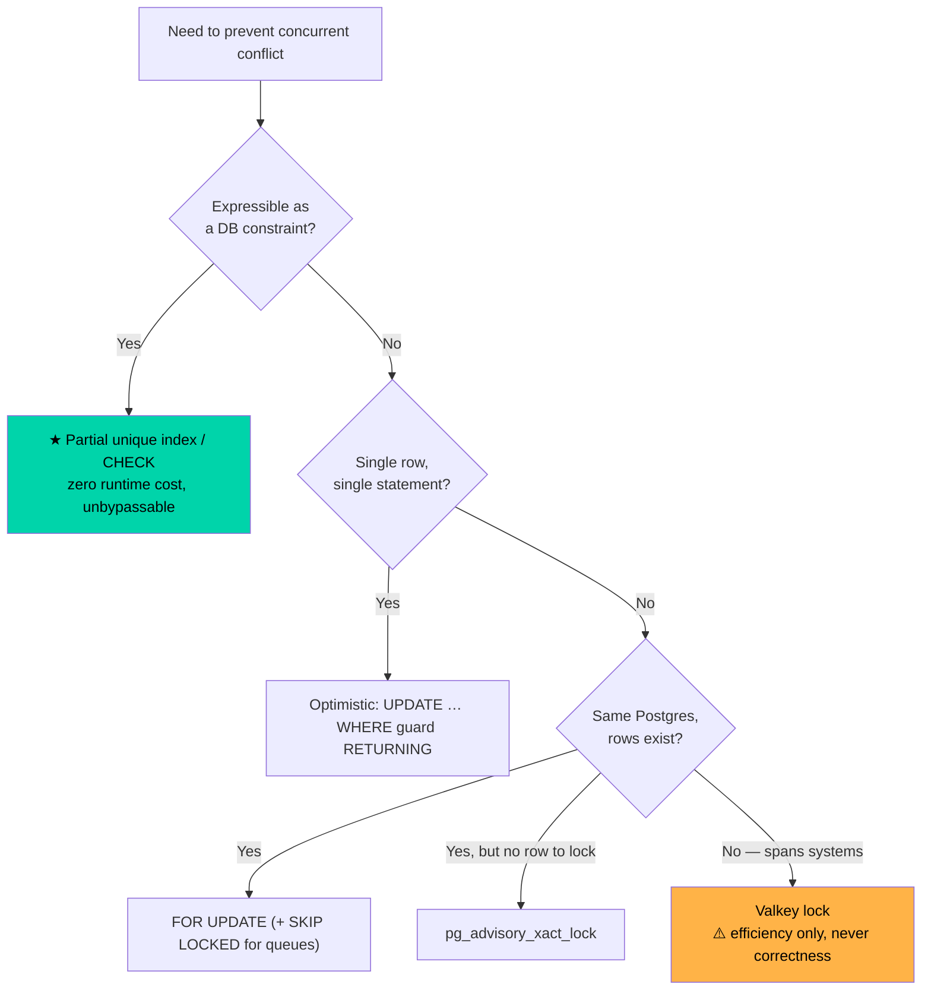

### 4.6 The transactional outbox

**Fixes:** P1-8, P1-10 · **Phase:** 3

The problem in one sentence: you cannot atomically commit to Postgres *and* publish to Socket.IO/Redpanda, because they are different systems with no shared transaction — so any ordering you pick has a failure mode.

```
Emit first, then commit  → DB write fails, clients already told. Phantom event.
Commit first, then emit  → process dies between them. Event lost forever.
```

The outbox dissolves the dilemma: **write the event to a Postgres table inside the same transaction.** Now the event and the state change share a commit — atomic by construction. A separate relay publishes afterward.

```js
// Inside the ride-acceptance transaction:
await withTransaction(async (client) => {
  const { rows } = await client.query(`
    UPDATE rides SET driver_id=$1, ride_status='accepted', version=version+1
     WHERE ride_id=$2 AND ride_status='requested'
    RETURNING ride_id, passenger_id, driver_id`, [driverId, rideId]);

  if (rows.length === 0) throw new ConflictError('RIDE_ALREADY_ACCEPTED');

  await client.query(`INSERT INTO ride_events (ride_id, from_status, to_status, actor_id, actor_role)
                      VALUES ($1,'requested','accepted',$2,'driver')`, [rideId, driverId]);

  // Same transaction. Rolls back with everything else if anything fails.
  await client.query(`INSERT INTO outbox (aggregate_type, aggregate_id, event_type, payload)
                      VALUES ('ride',$1,'ride.accepted',$2)`, [String(rideId), rows[0]]);
}, { actorId: driverId });
// ← No emit here. Ever. That is the point.
```

The relay worker, running continuously:

```js
async function relayBatch() {
  const events = await withTransaction(async (client) => {
    const { rows } = await client.query(`
      SELECT * FROM outbox WHERE published_at IS NULL
      ORDER BY created_at FOR UPDATE SKIP LOCKED LIMIT 100`);
    return rows;
  });

  for (const e of events) {
    await producer.send({ topic: e.event_type,
                          messages: [{ key: e.aggregate_id, value: JSON.stringify(e.payload) }] });
    await pool.query('UPDATE outbox SET published_at = now() WHERE id = $1', [e.id]);
  }
}
```

**This is at-least-once, not exactly-once.** If the process dies after `producer.send` but before the `UPDATE`, the event republishes. That is *by design* — exactly-once delivery is impossible across a network. The correct response is **idempotent consumers**: every event carries a stable id, and every consumer records what it has processed.

```js
// Consumer side — an event seen twice must be a no-op the second time.
async function handleRideAccepted(event) {
  await withTransaction(async (client) => {
    const { rowCount } = await client.query(
      `INSERT INTO processed_events (event_id, consumer) VALUES ($1,'notifier')
       ON CONFLICT DO NOTHING`, [event.id]);
    if (rowCount === 0) return;   // already handled. Silently, correctly, done.
    await notifyPassenger(event.payload);
  });
}
```

Same principle secures SSLCommerz (P1-10), which deliberately fires both `/payment/success` and `/payment/ipn` for one transaction:

```js
await withTransaction(async (client) => {
  const { rowCount } = await client.query(
    `INSERT INTO idempotency_keys (key, scope, request_hash, expires_at)
     VALUES ($1,'payment',$2, now() + interval '7 days') ON CONFLICT (key) DO NOTHING`,
    [`sslcz:${tran_id}`, hashOf(req.body)]);
  if (rowCount === 0) return;   // second callback for the same txn — ignore

  const verified = await sslcz.validate({ val_id });
  if (verified.status !== 'VALID' && verified.status !== 'VALIDATED') throw new PaymentError();

  // The check the current code never performs (P1-10):
  const expected = await client.query('SELECT amount_minor FROM payments WHERE ride_id=$1', [rideId]);
  const gatewayMinor = Math.round(Number(verified.amount) * 100);
  if (gatewayMinor !== Number(expected.rows[0].amount_minor)) {
    throw new PaymentError('AMOUNT_MISMATCH');   // never trust the gateway's number blindly
  }

  await client.query(`UPDATE payments SET payment_status='paid', paid_at=now(),
                        gateway_amount_minor=$1, verified_at=now(), raw_gateway_response=$2
                      WHERE ride_id=$3 AND payment_status <> 'paid'`,
                     [gatewayMinor, verified, rideId]);
}, { isolation: 'SERIALIZABLE', maxRetries: 5 });
```

### 4.7 The geospatial matching engine

**Fixes:** §1.6 entirely · **Phase:** 4

#### Why not just `ORDER BY distance LIMIT 10`?

Because it is `O(n)` over every driver, computing a trigonometric distance for each, on every request. At 10,000 drivers and 100 requests/sec that is a million Haversine evaluations per second and a full table scan each time.

Spatial indexes exist to answer *"which candidates are even worth measuring?"* in sublinear time.

#### Three indexing families

**1 · R-tree (PostGIS GiST)** — nested bounding rectangles.

```sql
CREATE INDEX ON driver_locations USING GIST (geog);
SELECT driver_id, ST_Distance(geog, $1::geography) AS m
  FROM driver_locations
 WHERE is_available AND ST_DWithin(geog, $1::geography, 3000)
 ORDER BY geog <-> $1::geography      -- KNN operator, index-assisted
 LIMIT 10;
```

*Exact distances, arbitrary geometry, fully transactional. But research is explicit that R-trees struggle when the indexed points move constantly — every driver ping is an index update, and rebalancing under sustained write load is the bottleneck.*

**2 · Geohash** — interleave lat/lng bits into a base-32 string; shared prefix ≈ proximity.

*Elegant and simple, but two fatal wrinkles: cells are rectangular and distort badly toward the poles, and points either side of a prefix boundary are far apart in string space while being metres apart physically — so you must always query the cell plus its 8 neighbours.*

**3 · H3 — hexagonal hierarchical index (our hot path).**

```js
import { latLngToCell, gridDisk } from 'h3-js';

const RES = 8;                                     // ~0.74 km² per cell
const origin = latLngToCell(pickupLat, pickupLng, RES);
const searchCells = gridDisk(origin, 1);           // origin + 6 neighbours = 7 cells

// Valkey: one set per cell. Union of 7 small sets — no scan, no trigonometry.
const candidates = await valkey.sunion(...searchCells.map(c => `drivers:avail:${c}`));
// Widen only if thin:
if (candidates.length < 5) { /* gridDisk(origin, 2) → 19 cells */ }
```

Research: Uber and Grab find the nearest driver **under 100 ms** doing exactly this — resolution 8, look at the 7 nearest cells.

**Why hexagons, precisely:** with square cells, the 8 surrounding cells sit at two different centre-to-centre distances — 4 at *d*, 4 at *d√2*. "One ring out" therefore means two different radii, and your search area is a distorted square, not a circle. Hexagons have exactly **6 neighbours, all equidistant**. A k-ring is a near-perfect circle, and expanding it grows the radius uniformly.

| Res | Avg edge | Avg area | Use |
|---|---|---|---|
| 7 | 1.22 km | 5.16 km² | Sparse/rural matching |
| **8** | **0.46 km** | **0.74 km²** | **Urban matching — our default** |
| 9 | 0.17 km | 0.11 km² | Dense city centre, surge granularity |
| 10 | 0.065 km | 0.015 km² | Pickup-point precision |

#### The hybrid design

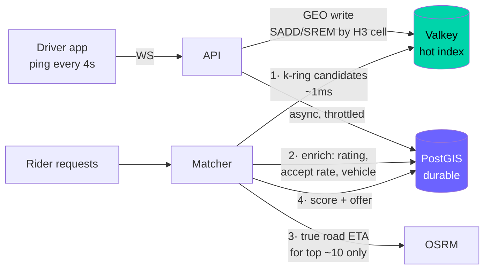

The insight is the **read/write asymmetry**. Driver positions are written constantly and read constantly, but need zero durability — losing them costs 4 seconds. That belongs in memory. Ride geometry, geofences, and historical analysis are written rarely, read analytically, and must be durable. That belongs in PostGIS. One system cannot be optimal for both, so we stop pretending.

**We build PostGIS-only first and benchmark it under k6** before adding Valkey. The crossover is a measurement, not an opinion — and having the number is worth more than having the architecture.

#### Candidate scoring

```js
function scoreDriver(d, ride) {
  const etaScore      = Math.max(0, 1 - d.etaSeconds / 900);      // 15 min → 0
  const ratingScore   = (d.ratingAverage ?? 4.0) / 5;
  const accScore      = d.acceptanceRate ?? 0.8;                  // anti-cherry-picking
  const fairnessScore = Math.min(1, d.idleSeconds / 1800);        // waited longer → boosted
  return 0.45 * etaScore + 0.20 * ratingScore + 0.15 * accScore + 0.20 * fairnessScore;
}
```

The fairness term matters ethically as well as technically: without it, drivers in busy areas monopolize work while drivers who have waited 40 minutes never get an offer. Weights are configuration, tunable by measurement.

#### Dispatch offers, not a free-for-all

Replaces the "fastest thumb wins" broadcast (§1.6):

1. Matcher picks the top-3 candidates, ranks them.
2. Offer rank 1 exclusively, `expires_at = now() + 15s`. `ride_offers_one_live_per_ride` makes double-offering impossible.
3. Accept → `outcome='accepted'`, ride → `accepted`, others → `superseded`.
4. Decline or expire → sweeper offers rank 2. Track declines: acceptance rate feeds back into scoring.
5. All exhausted → widen to `gridDisk(origin, 2)` and re-match.

#### Surge, computed honestly

```sql
-- Per H3 cell over a 5-minute window
INSERT INTO surge_cells (h3_r8, demand_count, supply_count, multiplier, computed_at)
SELECT cell,
       demand, supply,
       LEAST(3.00, GREATEST(1.00, ROUND((demand::numeric / NULLIF(supply,0)) * 0.6, 2))),
       now()
FROM (
  SELECT r.pickup_h3_r8 AS cell,
         COUNT(*) FILTER (WHERE r.requested_at > now() - interval '5 min') AS demand,
         (SELECT COUNT(*) FROM driver_locations dl
           WHERE dl.h3_r8 = r.pickup_h3_r8 AND dl.is_available)             AS supply
    FROM rides r
   WHERE r.ride_status IN ('requested','offered')
   GROUP BY r.pickup_h3_r8
) s
ON CONFLICT (h3_r8) DO UPDATE
   SET demand_count = EXCLUDED.demand_count,
       supply_count = EXCLUDED.supply_count,
       multiplier   = EXCLUDED.multiplier,
       computed_at  = EXCLUDED.computed_at;
```

Capped at 3.00 in the `CHECK` constraint — a runaway surge multiplier is a headline, and the cap belongs in the schema, not in a config file someone can edit.

### 4.8 Row-Level Security as defense in depth

**Phase:** 5

Research consensus for 2026: "Supabase, Neon, and most JWT-based stacks now treat RLS as the primary authorization boundary — the database itself decides whether a given user can see a given row." Our framing is slightly more conservative: RLS is the **last** line, not the only one. The API still authorizes; RLS ensures that an API bug cannot become a data breach.

```sql
-- The app connects as a non-superuser. Superusers bypass RLS entirely — a classic footgun.
CREATE ROLE app_user NOLOGIN;
GRANT SELECT, INSERT, UPDATE ON ALL TABLES IN SCHEMA public TO app_user;

ALTER TABLE rides    ENABLE ROW LEVEL SECURITY;
ALTER TABLE messages ENABLE ROW LEVEL SECURITY;
ALTER TABLE payments ENABLE ROW LEVEL SECURITY;

CREATE OR REPLACE FUNCTION app_current_user_id() RETURNS INT
LANGUAGE sql STABLE AS $$
  SELECT NULLIF(current_setting('app.current_user_id', true), '')::INT
$$;

-- A user sees only rides they are party to.
CREATE POLICY rides_participant_select ON rides FOR SELECT TO app_user
  USING (passenger_id = app_current_user_id() OR driver_id = app_current_user_id());

-- Drivers may see unclaimed requests (so they can be offered one) but no other open ride.
CREATE POLICY rides_open_to_drivers ON rides FOR SELECT TO app_user
  USING (ride_status = 'requested' AND EXISTS (
    SELECT 1 FROM drivers d WHERE d.user_id = app_current_user_id() AND d.status_v2 = 'active'));

-- In-ride chat is visible only to that ride's two participants.
CREATE POLICY messages_participant ON messages FOR ALL TO app_user
  USING (EXISTS (SELECT 1 FROM rides r WHERE r.ride_id = messages.ride_id
                   AND (r.passenger_id = app_current_user_id()
                        OR r.driver_id = app_current_user_id())));
```

`withTransaction` sets `app.current_user_id` with `LOCAL` scope on every transaction (§4.1), so the binding is per-request and cannot leak across pooled connections.

**Why this matters concretely:** today, if a controller forgot its `WHERE passenger_id = $1`, it returns every ride in the database. With RLS, that same bug returns *the user's* rides. The bug is still a bug — but it is no longer a breach.

Watch the performance trap: an RLS policy is appended to every query as an implicit `WHERE`. Wrap `current_setting()` calls in a `STABLE` function (as above) so the planner evaluates them once per query rather than per row — the difference is easily 10×.

### 4.9 Refresh token rotation with reuse detection

**Fixes:** P1-3, P1-14 · **Phase:** 5

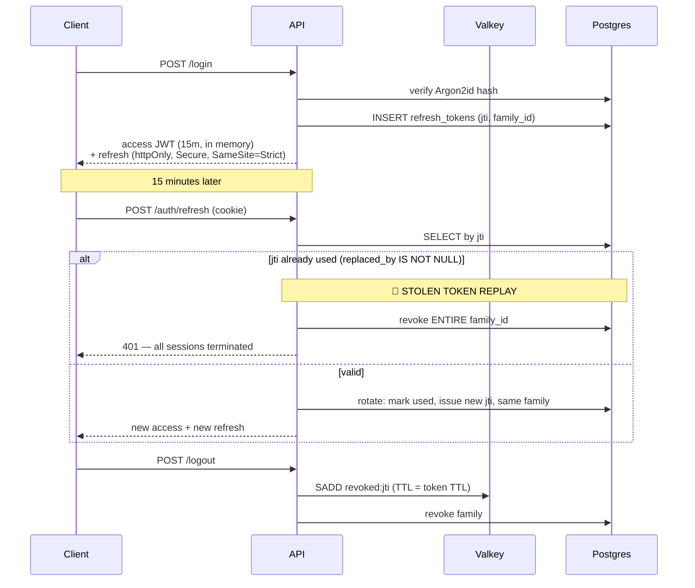

Rotation with family tracking gives you something a plain long-lived JWT never can: **theft detection**. If an attacker steals a refresh token and uses it, the legitimate client's next refresh presents an already-rotated `jti` — the server sees a token used twice, concludes the family is compromised, and kills every session in it. The user gets logged out and knows something happened. That is a far better outcome than silent, indefinite impersonation.

Socket.IO authentication, fixing P1-2:

```js
io.use(async (socket, next) => {
  const token = socket.handshake.auth?.token;
  if (!token) return next(new Error('UNAUTHENTICATED'));
  try {
    const claims = jwt.verify(token, config.JWT_SECRET);
    if (await valkey.sismember('revoked:jti', claims.jti)) return next(new Error('REVOKED'));
    socket.data.user = claims;
    next();
  } catch { next(new Error('UNAUTHENTICATED')); }
});

io.on('connection', (socket) => {
  const { userId, role } = socket.data.user;

  // Rooms are derived from the VERIFIED token — never from client input.
  // This one line closes the IDOR.
  socket.join(`user_${userId}`);
  if (role === 'driver') socket.join('drivers');

  socket.on('driver_location_update', rateLimit(1, '1s', async (data) => {
    if (role !== 'driver') return;
    // passenger_id is looked up server-side from the driver's ACTIVE ride.
    // Never accepted from the payload (which today lets anyone forge a position).
    const ride = await getActiveRideForDriver(userId);
    if (!ride) return;
    await updateDriverLocation(userId, data);
    socket.to(`user_${ride.passenger_id}`).emit('driver_location_update', {
      rideId: ride.ride_id, lat: data.lat, lng: data.lng, heading: data.heading });
  }));
});
```

Three changes, and the entire class of attack in Trace C disappears: **there is no `join_room` handler at all.**

### 4.10 Proving it: the concurrency test harness

**Phase:** 3

Every claim above is falsifiable, and we falsify it. Against a real Postgres in Testcontainers:

```js
test('exactly one driver wins a contested ride', async () => {
  const rideId = await seedRequestedRide();
  const drivers = await seedDrivers(50);

  // 50 genuinely simultaneous accepts.
  const results = await Promise.allSettled(
    drivers.map(d => acceptRide({ driverId: d.id, rideId }))
  );

  const won = results.filter(r => r.status === 'fulfilled').length;
  expect(won).toBe(1);                                    // exactly one

  const { rows } = await pool.query('SELECT driver_id, ride_status FROM rides WHERE ride_id=$1', [rideId]);
  expect(rows[0].ride_status).toBe('accepted');
  expect(rows[0].driver_id).not.toBeNull();

  const events = await pool.query('SELECT * FROM ride_events WHERE ride_id=$1', [rideId]);
  expect(events.rowCount).toBe(1);                        // no duplicate transitions
});

test('a passenger cannot create two active rides', async () => {
  const p = await seedPassenger();
  const results = await Promise.allSettled(
    Array.from({ length: 20 }, () => requestRide({ passengerId: p.id, ...DHAKA_TRIP }))
  );
  expect(results.filter(r => r.status === 'fulfilled')).toHaveLength(1);
  // The 19 losers must fail on the CONSTRAINT, not on the app pre-check —
  // that is what proves the database, not the JS, is holding the line.
  const rejected = results.filter(r => r.status === 'rejected');
  expect(rejected.every(r => r.reason.code === '23505')).toBe(true);
});
```

The second assertion is the important one. It doesn't just check the outcome — it checks *which mechanism produced it*.

### 4.11 Connection pool sizing

**Phase:** 1 / 7 checkpoint

A pool that is too large is worse than one that is too small — this surprises most people.

```
pool_size ≈ ((core_count × 2) + effective_spindle_count)
```

On a 4-core laptop with an SSD: `(4 × 2) + 1 = 9`. Round to **10**.

Beyond that, connections don't add throughput — they add context switching, lock contention, and memory (each PostgreSQL backend is a process with its own `work_mem`). Little's Law explains why: `L = λW`. If your service takes 20 ms (`W`) and you want 500 req/s (`λ`), you need `L = 500 × 0.020 = 10` concurrent connections. Not 100. Adding the other 90 makes `W` *worse*, which makes throughput worse.

The current `db.js` uses the `pg` default (10) but the P1-6 design **checks out a fresh connection per write statement**, so a request doing three writes churns three connections sequentially — tripling checkout overhead and pool pressure for no benefit. `withTransaction` uses one connection for the whole unit of work.

---

## §5 Execution Roadmap

Ten phases. **The application boots and works at the end of every one** (D3, strangler fig). Each closes with a Human Learning Checkpoint — I teach the concept, with examples drawn from *this* codebase, **before** we generate the code for the next phase.

### How a Human Learning Checkpoint works

Not a summary. A structured teaching session with five parts:

1. **The intuition** — a plain-language analogy, no jargon.
2. **The mechanism** — what actually happens, precisely.
3. **In *your* code** — the specific `file:line` where this concept was missing or present, and what it caused.
4. **Hands-on** — something you run yourself (usually two `psql` terminals side by side, or a `k6` script) and observe.
5. **Self-check** — 3–5 questions. If you can answer them unprompted, we proceed. If not, we go again from a different angle. **You decide when to move on, not me.**

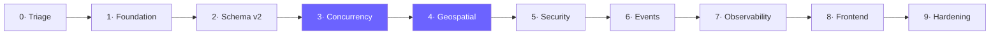

Phases 3 and 4 are the intellectual core. Everything before them is preparation; everything after builds on them.

---

### Phase 0 — Triage: make it run, stop the bleeding

> **Objective:** the backend starts, and the secrets are no longer live.
> **Fixes:** P0-1 · P0-2 · P0-3 · P0-4 · P0-5

**Work items**

| # | Task | File |
|---|---|---|
| 0.1 | Comment out the prose on line 7 (lines 9–11 below it are already correct comments) | `backend/middleware/tokenBlacklist.js:7` |
| 0.2 | Add `adminRejectDriver` to the destructured import | `backend/routes/routes.js:4` |
| 0.3 | Remove the hardcoded password fallback; fail loudly if `PG_PASSWORD` is unset | `database/db.js:6` |
| 0.4 | **You rotate**: new `JWT_SECRET`, new PG password, new `ADMIN_LEVEL*`, and regenerate SSLCommerz sandbox credentials **at the provider** | — |
| 0.5 | `git rm --cached backend/.env`; purge from history with `git filter-repo`; force-push | — |
| 0.6 | `git rm -r --cached node_modules` (1,145 files) and all `.DS_Store` | — |
| 0.7 | Harden `.gitignore`; add `backend/.env.example` with key names and empty values | — |
| 0.8 | Install `git-secrets` pre-commit hook so this cannot recur | — |
| 0.9 | Fix `express.static` to resolve from `__dirname`; delete the dead `public/index.html` | `startPoint.js:11` |

**⚠️ Items 0.4–0.6 are destructive and outward-facing.** History rewriting changes every commit SHA and requires a force-push that will disrupt the `Nemo` and `blackhatcrow` branches. **I will not run these without your explicit go-ahead**, and 0.4's SSLCommerz rotation you must do yourself at the provider — I have no access. If any collaborator has clones, they must re-clone after the force-push.

**Exit criteria**
- [ ] `node --check` passes on every file under `backend/`
- [ ] `cd backend && npm run dev` boots without error
- [ ] `curl localhost:4000/db-health` → `200`
- [ ] `git ls-files | wc -l` drops from 1213 to **< 70**
- [ ] `git log --all -- backend/.env` returns nothing
- [ ] Old `JWT_SECRET` no longer authenticates

> #### 🎓 Human Learning Checkpoint 0 — "Git never forgets, and secrets are not text"
>
> **Intuition:** deleting a secret from a file is like tearing a page out of a book after the library has already photocopied it and shipped copies worldwide. The page is gone from *your* copy. Every other copy still has it.
>
> **Mechanism:** git stores immutable content-addressed objects. A commit that ever contained `JWT_SECRET=abc` holds that blob forever, reachable by SHA even after the file is deleted, and it is present in every clone, fork, and CI cache. `.gitignore` only affects *untracked* files — which is precisely why adding it in `db5f3d2` did nothing for the already-tracked `backend/.env`.
>
> **In your code:** `6749d1d` added `backend/.env`. Between then and now it has been pushed to a public GitHub repo and merged across three branches. `register.js:82-88` turns `ADMIN_LEVEL2` from "a secret" into "the complete admin authorization check" — reading the repo *is* the privilege escalation.
>
> **Hands-on:** you will run `git log --all --full-history -- backend/.env` and then `git show 6749d1d:backend/.env` to see the live secret retrieved from history *after* the file is deleted from the working tree. Then we purge and you re-run both to see them fail.
>
> **Self-check:**
> 1. Why did adding `.env` to `.gitignore` not protect the already-committed file?
> 2. After `git filter-repo`, why must you *still* rotate every secret?
> 3. Why is `ADMIN_LEVEL2` worse than `PG_PASSWORD` here, even though a DB password sounds scarier?
> 4. What makes `git-secrets` a structurally better fix than "remember not to commit `.env`"?

---

### Phase 1 — Foundation: containers, migrations, config, logging

> **Objective:** one command brings up the whole stack; schema changes become versioned; config fails fast.
> **Fixes:** P1-6 · P2-8 · P2-12 · P2-15 · P2-16 · P2-17 · P0-5

**Work items**

- `docker-compose.yml` with `core` / `full` profiles (§2.6). Start with `postgres` + `valkey` only.
- `node-pg-migrate`: convert `schema.sql` into ordered, reversible migrations. Strip the 170 lines of commented seed data (P2-7) into a proper `seed.js`. Delete the stray `select *` at `schema.sql:286`.
- `src/config.js`: Zod-validated environment. Missing or malformed `JWT_SECRET` → the process refuses to start with a readable message. No silent fallbacks (P0-5).
- **Rewrite `database/db.js`**: `withTransaction()` per §4.1, plus a `sql` tagged-template helper. This unblocks most of Phase 3.
- `pino` structured logging + `pino-http` with per-request correlation IDs.
- npm workspaces at root (P2-12); shared `Makefile`.
- Fix `shutdown()` to `server.close()` then drain the pool (P2-17); fix middleware ordering (P2-16).
- Rename `database/func precheck_info.sql` (P2-11).

**Exit criteria**
- [ ] `docker compose --profile core up` → healthy Postgres + Valkey
- [ ] `npm run migrate:up` builds the schema from empty; `migrate:down` reverses it cleanly
- [ ] `npm run seed` produces a usable dataset
- [ ] Deleting a required env var prevents startup with a clear error
- [ ] `withTransaction` demonstrably rolls back all writes when the callback throws
- [ ] `SIGTERM` drains in-flight requests before exiting

> #### 🎓 Human Learning Checkpoint 1 — "Reproducibility: migrations, config, and the transaction boundary"
>
> **Intuition:** `schema.sql` is a photograph of the database. A migration set is the *film* — you can play it forward from nothing, or rewind it. Photographs can't tell you how you got there, and can't be replayed on a colleague's machine.
>
> **Mechanism:** each migration is timestamped, applied exactly once, and recorded in a `pgmigrations` table. Any machine reaches an identical schema by replaying the same ordered list. `down` migrations make mistakes cheap, which is what makes you willing to change the schema at all.
>
> **In your code:** `schema.sql` is 286 lines of which 170 are commented-out inserts, ending in a stray `SELECT`. There is no way to know whether a given database has had `functions.sql` applied. And `db.js:25-52` (P1-6) makes multi-statement atomicity impossible — I will show you `rateRide.js:39-59` failing halfway and leaving a rating recorded against a stale driver average.
>
> **Hands-on:** you'll run `migrate:up` on an empty container, then `migrate:down` back to zero, then up again. Then we'll deliberately throw inside a `withTransaction` and watch every write vanish — the thing today's `query()` cannot do.
>
> **Self-check:**
> 1. Why must migrations be immutable once applied and shared?
> 2. What is the actual failure mode of `BEGIN`/`COMMIT` around a *single* statement?
> 3. Why does a pooled connection make `SET` (without `LOCAL`) dangerous?
> 4. Why is a hardcoded fallback password worse than *no* default at all?

---

### Phase 2 — Schema v2: correctness by construction

> **Objective:** the database refuses invalid data, regardless of application behaviour.
> **Fixes:** P1-7 · P1-11 · P1-12 · P1-13 · P2-1 → P2-5 · P2-9 · P2-10

**Work items**

- Enum types + a `BEFORE UPDATE` trigger validating ride state transitions against §2.3.
- **The partial unique indexes** (§4.4) — `rides_one_active_per_passenger`, `rides_one_active_per_driver`, `ride_offers_one_live_per_*`, `ratings_one_per_rater_per_ride`.
- `CHECK` constraints: distance bounds (kills the P1-9 fare-inflation vector), non-negative fares, driver-required-after-accept.
- Rebuild `ratings` with `rater_id` / `ratee_id`; add `rating_count` / `rating_sum` and make `rating_average` a `GENERATED` column.
- Money → `amount_minor BIGINT` + `currency`; migrate existing decimals.
- Real soft delete: `is_active`, `deleted_at`, plus a `user_audit` trail. Rewrite `deactivateUser` (P1-12).
- `ride_events` append-only (`REVOKE UPDATE, DELETE`); `outbox`; `idempotency_keys`.
- PostGIS columns + GiST indexes; backfill `geog` from existing lat/lng; H3 cells via `h3-pg`.
- `location_logs_v2` monthly range partitioning + a partition-creation job.
- Indexes for every real access pattern (P2-5).
- Harden `complete_ride`: idempotent, state-guarded, server-computed distance (P1-9).

**Exit criteria**
- [ ] Two concurrent ride requests for one passenger → exactly one succeeds, loser gets `23505`
- [ ] `INSERT ... ride_status='compelted'` → type error
- [ ] An illegal transition (`requested` → `completed`) → trigger rejection
- [ ] Both passenger and driver can rate the same ride; neither can rate twice
- [ ] `complete_ride` called twice → `total_distance` incremented once
- [ ] `EXPLAIN` shows index usage on all hot queries
- [ ] Migration runs against a seeded copy of the *existing* data without loss

> #### 🎓 Human Learning Checkpoint 2 — "Making illegal states unrepresentable"
>
> **Intuition:** there are two ways to stop cars driving off a cliff. Put up a sign saying "please don't." Or build a guardrail. Application `if` statements are signs — they work until someone isn't looking. Constraints are guardrails.
>
> **Mechanism:** a partial unique index indexes only rows satisfying its `WHERE`. The uniqueness check happens *inside* the same atomic operation as the write, so there is no check-then-act window — not because we were careful, but because no such window exists to be careless in.
>
> **In your code:** `rideRequest.js:25-32` is the sign. We replace it with the guardrail and keep the sign for its error message. I'll also show you the subtler prize: the constraint protects against code that doesn't exist yet — an admin tool, a data-fix script, a `psql` session at 2am.
>
> **Hands-on — two terminals, side by side:**
> ```sql
> -- Terminal A                          -- Terminal B
> BEGIN;
> INSERT INTO rides (...) VALUES (...);
>                                        BEGIN;
>                                        INSERT INTO rides (...) VALUES (...);
>                                        -- ← B BLOCKS here. Watch it hang.
> COMMIT;
>                                        -- ERROR: duplicate key ... 23505
> ```
> You will watch terminal B freeze, then fail the instant A commits. Then we drop the index and repeat — and both succeed, reproducing the live bug on demand.
>
> **Self-check:**
> 1. Why does terminal B *block* rather than fail immediately?
> 2. Why can't an application-level check ever be as strong, no matter how careful?
> 3. Why is a `GENERATED` `rating_average` better than an `UPDATE` after each rating?
> 4. Why store money as `BIGINT` poisha rather than `DECIMAL(10,2)`?
> 5. What does `REVOKE UPDATE, DELETE ON ride_events` buy you that a code convention doesn't?

---

### Phase 3 — Concurrency, transactions and the outbox ★

> **Objective:** the system is provably correct under concurrent load.
> **Fixes:** P1-6 · P1-8 · P1-9 · P1-10 · P1-11
> **This is the most important phase in the plan.**

**Work items**

- Apply `withTransaction` across all 16 controllers; delete every ad-hoc `query()` write sequence.
- Formalize optimistic acceptance (§4.2) with `version` bumps and typed `ConflictError` → HTTP 409.
- `FOR UPDATE SKIP LOCKED` dispatch/outbox queue (§4.5).
- `pg_advisory_xact_lock` where multi-statement per-driver serialization is needed.
- Payment settlement under `SERIALIZABLE` + idempotency keys + **amount verification** (§4.6).
- Outbox relay worker; **remove every `global.io.emit` from controllers** (P1-8, P2-18).
- Ride lifecycle saga with explicit compensating actions (cancel-after-accept, payment failure, driver no-show).
- Valkey distributed lock helper — clearly labelled *efficiency only* (§4.5).
- Concurrency test harness (§4.10) + Toxiproxy fault injection.

**Exit criteria**
- [ ] 50 simultaneous accepts on one ride → **exactly 1** success, verified against `ride_events`
- [ ] 20 simultaneous requests from one passenger → exactly 1, losers fail on the **constraint**
- [ ] Duplicate SSLCommerz callback → exactly one settlement
- [ ] A payment where the gateway amount ≠ our amount is **rejected**
- [ ] Killing the API mid-transaction leaves **zero** partial writes
- [ ] Killing the relay mid-publish → event redelivered, consumer idempotent, no duplicate effect
- [ ] `grep -r "global.io" backend/` returns nothing

> #### 🎓 Human Learning Checkpoint 3 — "Concurrency: the deep session" ★
>
> The longest checkpoint. Budget real time — this is the material that separates a term project from a system.
>
> **Part A · Optimistic vs pessimistic.** Two people reaching for the last item on a shelf. Pessimistic: put your hand on it before deciding. Optimistic: grab it and check whether you actually got it. Neither is "better" — it depends entirely on how often two hands arrive at once. Then: `rideAccept.js:29-34` is *already* optimistic locking, done correctly. You wrote a good thing. We'll make sure you know exactly why it works.
>
> **Part B · Isolation levels, demonstrated not described.** Two `psql` terminals, and we reproduce each anomaly live:
> - *Non-repeatable read* — A reads a row, B updates and commits, A reads again and sees different data.
> - *Phantom read* — A counts rows, B inserts, A counts again and gets more.
> - *Write skew* — the subtle one. Both read, both decide independently, both commit, invariant violated. **This is the exact shape of your P1-7 bug**, and it's invisible at the default level.
>
> Then we raise the level and watch each anomaly disappear — and watch `SERIALIZABLE` abort a transaction with `40001`, which is where you'll understand why the retry loop in §4.1 is mandatory rather than defensive.
>
> **Part C · `SKIP LOCKED`.** Run 4 workers against a queue *without* it — throughput stays flat as you add workers, because they queue behind each other. Add `SKIP LOCKED` and watch it scale linearly. Seeing that graph is worth more than any explanation.
>
> **Part D · The outbox.** Why "commit then emit" and "emit then commit" are *both* wrong, and how making the event part of the transaction dissolves the problem. Then: why at-least-once is the best any network can offer, and why that makes idempotent consumers non-negotiable rather than nice-to-have.
>
> **Self-check:**
> 1. Two drivers accept simultaneously. Walk through, statement by statement, why exactly one gets a row back.
> 2. What is write skew, and why doesn't `READ COMMITTED` prevent it?
> 3. Why *must* code using `SERIALIZABLE` have a retry loop?
> 4. Why does `SKIP LOCKED` scale where plain `FOR UPDATE` doesn't?
> 5. Why is exactly-once delivery impossible, and what do we do instead?
> 6. Your API crashes right after `producer.send` but before marking the outbox row published. What happens, and why is that acceptable?
> 7. Why is jitter necessary in the retry backoff?

---

### Phase 4 — Geospatial & the matching engine ★

> **Objective:** replace "broadcast to everyone" with real proximity-based dispatch.
> **Fixes:** all of §1.6

**Work items**

1. **PostGIS-only matcher first.** `ST_DWithin` + KNN. Simple, transactional, correct.
2. **Benchmark it** with k6 at 100 / 1,000 / 10,000 drivers. **Record the numbers in `progress.md`** — this is data, not opinion.
3. **Add the H3 + Valkey hot index.** Cell-keyed sets, k-ring lookup, TTL heartbeats.
4. **Benchmark again. Compare.** Find *your* crossover point.
5. OSRM container + Bangladesh OSM extract; real distance/ETA/polyline. `distance_km` becomes server-computed (closes P1-9's remaining vector).
6. Candidate scoring (§4.7) with ETA, rating, acceptance rate, and the fairness term.
7. Dispatch-offer protocol: exclusive, 15s expiry, ranked fallback, sweeper worker.
8. Signed fare quotes with expiry — price promised *before* the ride, HMAC so the client cannot tamper.
9. Surge per H3 cell, capped at 3.00 by `CHECK`.
10. Delete the `global.io.emit` broadcast and the unbounded `availableRides` query.

**Exit criteria**
- [ ] A request reaches only drivers within the k-ring, filtered by vehicle type and availability
- [ ] p99 matching latency **< 100 ms** at 10,000 simulated drivers
- [ ] Documented benchmark: PostGIS vs H3+Valkey, with the crossover identified
- [ ] Declined/expired offers cascade to the next candidate automatically
- [ ] A tampered quote signature is rejected
- [ ] `distance_km` from the client is ignored entirely

> #### 🎓 Human Learning Checkpoint 4 — "Geospatial indexing, and why hexagons"
>
> **Intuition:** finding nearby drivers by checking all of them is like finding a friend in a stadium by walking every row. Spatial indexing is knowing they're in section 14 — you check one section, not the stadium.
>
> **Mechanism:** we walk all three families. R-trees (nested bounding boxes — exact, but rebalancing hurts under constant writes). Geohash (bit-interleaving into a string — elegant, but boundary-adjacent points are far apart in string space). H3 (hexagonal, hierarchical — uniform neighbours).
>
> **The hexagon argument, properly:** I'll draw it. With squares, your 8 neighbours sit at two different distances — 4 at *d*, 4 at *d√2*. So "one ring out" is not a circle, it's a distorted square, and your radius search is systematically wrong in the diagonals. Hexagons have exactly 6 neighbours, all equidistant. A k-ring is a near-circle. That is the entire reason Uber built H3, and why research shows them and Grab hitting sub-100ms dispatch with resolution-8 cells and a 7-cell lookup.
>
> **The deeper lesson — read/write asymmetry.** Driver positions: written constantly, read constantly, durability worth ~4 seconds. Ride geometry: written once, read analytically, must survive a crash. These are *different problems* and forcing one store to serve both is why the naive design gets slow. Recognizing this asymmetry generalizes far beyond maps.
>
> **Hands-on:** you'll run the same "find nearby drivers" query against PostGIS and against H3+Valkey at 100, 1k, and 10k drivers, and plot both. You'll see PostGIS win at small N (no network hop) and lose at large N. **You'll have measured the tradeoff, not been told it.**
>
> **Self-check:**
> 1. Why are hexagons better than squares for a radius search?
> 2. Why does a geohash search need 9 cells rather than 1?
> 3. Why do we keep PostGIS at all if H3 is faster for matching?
> 4. What breaks if `distance_km` stays client-supplied?
> 5. Why does the fairness term exist in the scoring function?
> 6. Why must a fare quote be signed *and* expire?

---

### Phase 5 — Auth, authorization & security hardening

> **Objective:** close every finding in §1.4.
> **Fixes:** P1-1 → P1-5 · P1-14 · P2-26

**Work items**

- Argon2id via `@node-rs/argon2`, with transparent rehash-on-login (no forced reset).
- Access/refresh split; refresh in `httpOnly; Secure; SameSite=Strict`; family rotation with reuse detection (§4.9).
- Valkey `jti` revocation replacing the in-memory `Map` (P1-14).
- **Delete the `ADMIN_LEVEL*` shared-secret path.** Replace with a bootstrap admin created by a seed script + an invite flow. Every admin action lands in an audit table.
- Declarative RBAC at the route table — `requireRole('driver')` — replacing 16 hand-rolled checks (P1-5). Fix `requireDriver` to check `status_v2 = 'active'`.
- Zod schemas on `body`/`params`/`query` for all 28 routes.
- `helmet`, CORS allowlist, `express-rate-limit` (Valkey-backed), `express-slow-down` on `/login`.
- **Socket.IO handshake auth + server-derived rooms (§4.9) — closes P1-2.**
- Postgres RLS policies (§4.8); app connects as non-superuser `app_user`.
- `ProtectedRoute` validates expiry and required role (P2-26).

**Exit criteria**
- [ ] Existing users log in and are silently upgraded to Argon2id
- [ ] An unauthenticated socket cannot connect at all
- [ ] `socket.emit('join_room', <someone else's id>)` has no effect — the handler no longer exists
- [ ] A forged `driver_location_update` for another passenger is dropped
- [ ] `ADMIN_LEVEL*` appears nowhere in the codebase
- [ ] With RLS on, a deliberately broken controller (`WHERE` removed) still returns only the caller's rows
- [ ] `/login` rate-limits after N attempts
- [ ] Refresh-token replay revokes the entire family

> #### 🎓 Human Learning Checkpoint 5 — "Authentication, authorization, and defense in depth"
>
> **Intuition:** authentication is the bouncer checking your ID at the door. Authorization is whether you're allowed in the VIP room. They are different questions, and your app currently answers the first well and the second sixteen inconsistent times.
>
> **Mechanism.** *Why SHA-256 is the wrong tool:* it's designed to be fast — that's its purpose — and password hashing needs deliberate slowness plus memory-hardness. I'll show you the arithmetic on how quickly a GPU exhausts your current hashes. *Why `localStorage` loses to `httpOnly` cookies:* one line of injected JS reads `localStorage`; nothing in JS can read an `httpOnly` cookie. *Why rotation beats long-lived tokens:* it converts silent indefinite theft into a detectable event.
>
> **In your code — the one I most want you to sit with:** `startPoint.js:32-35`. Four lines that let any stranger watch any passenger's driver move across the map in real time. Your HTTP layer is guarded; the WebSocket layer was never given the same thought. That asymmetry — securing the obvious door and leaving the window open — is one of the most common real-world breach patterns.
>
> **Hands-on:** with the app running, you'll open a plain Node script with no credentials, join a victim's room, and print their live GPS. Then we apply the fix and you'll watch the same script fail at the handshake. Seeing your own system leak is a different kind of learning than reading about it.
>
> **Self-check:**
> 1. Why is Argon2id better than SHA-256 *and* better than bcrypt here?
> 2. Why does `httpOnly` defeat XSS token theft but not CSRF — and what handles CSRF?
> 3. How does token-family rotation *detect* theft rather than just limiting it?
> 4. Why is RLS worth it when the API already checks authorization?
> 5. Why must the app connect as a non-superuser for RLS to mean anything?
> 6. Why derive socket rooms from the token instead of accepting a room id from the client?

---

### Phase 6 — Event-driven backbone

> **Objective:** Postgres becomes the source of truth; Socket.IO becomes a projection.

**Work items**

- Redpanda + Console in Compose; topics partitioned by `ride_id` for per-ride ordering.
- Outbox relay → Redpanda producer with retry and DLQ.
- Consumers: matcher, notifier, analytics projector — all idempotent via `processed_events`.
- `@socket.io/redis-adapter` on Valkey → multi-process fan-out.
- Client→server location updates throttled and backpressured.
- Event replay tooling: rebuild a projection from the log.
- Run 2 API instances behind a load balancer and prove events reach clients on either.

**Exit criteria**
- [ ] Every state change appears as a Redpanda event, inspectable in Console
- [ ] Replaying a topic rebuilds the analytics projection identically
- [ ] Killing one of two API instances doesn't drop a connected client's events
- [ ] A poisoned message lands in the DLQ without stalling the partition
- [ ] Replaying the same event twice produces no duplicate side effects

> #### 🎓 Human Learning Checkpoint 6 — "Event-driven architecture and delivery guarantees"
>
> **Intuition:** request/response is a phone call — both parties present, synchronous, and if one hangs up the exchange is lost. Events are the postal system — the sender drops it and moves on, delivery is guaranteed eventually, and the letter survives the sender going offline.
>
> **Mechanism:** the log as a durable, ordered, replayable source of truth. Why partition key determines ordering guarantees (and why `ride_id` is the right key — you need order *within* a ride, never *between* rides). Why consumer groups let you add capacity without duplicating work. Why "exactly once" is marketing and at-least-once + idempotency is engineering.
>
> **In your code:** today `global.io.emit()` *is* the event system — ephemeral, unordered, unreplayable, unauthenticated. A client offline for 10 seconds misses the acceptance permanently, with no way to recover it. With a log, they reconnect and catch up.
>
> **Hands-on:** in Redpanda Console you'll watch messages land in real time as you drive a ride through its lifecycle in the browser. Then you'll delete the analytics table and rebuild it entirely by replaying the topic — and see that a log is a *time machine*, not just a queue.
>
> **Self-check:**
> 1. Why does partitioning by `ride_id` give per-ride ordering but not global ordering — and why is that fine?
> 2. Why is exactly-once delivery impossible across a network?
> 3. What makes a consumer idempotent, concretely?
> 4. Why does the outbox belong in Postgres rather than the app publishing directly?
> 5. When would a DLQ save you, and what do you do with what lands there?

---

### Phase 7 — Observability, load testing & chaos

> **Objective:** every latency claim in this document becomes a measured number.

**Work items**

- OTel SDK auto-instrumentation (`http`, `express`, `pg`, `socket.io`, `ioredis`, `kafkajs`) → `grafana/otel-lgtm`.
- Custom spans on the paths that matter: `match.candidates`, `match.score`, `ride.accept`, `payment.settle`.
- RED metrics + business metrics (match rate, offer acceptance rate, surge distribution, p99 time-to-match).
- Grafana dashboards; alert rules on SLO burn.
- k6: steady-state, thundering-herd accept, sustained location stream, payment burst.
- Artillery: Socket.IO connection storms and message throughput (k6 can't do Socket.IO properly).
- Toxiproxy chaos: DB latency spikes, Valkey partition, Redpanda outage — assert invariants hold throughout.
- `pg_stat_statements` review; index tuning driven by measurement.

**Exit criteria**
- [ ] One trace spans browser → API → SQL → Valkey → Redpanda → back
- [ ] Documented SLOs with measured p50/p95/p99
- [ ] 500 concurrent riders sustained without error-rate degradation
- [ ] With Postgres at +500 ms injected latency, requests degrade gracefully — no data corruption
- [ ] With Valkey killed, matching falls back to PostGIS and still works
- [ ] Every slow query identified by `pg_stat_statements` is indexed or rewritten

> #### 🎓 Human Learning Checkpoint 7 — "Measuring systems: percentiles, traces, and Little's Law"
>
> **Intuition:** "average response time 50 ms" can describe a system where 90% of users get 10 ms and 10% get 410 ms. The average describes *nobody*. Percentiles describe actual people. p99 means one request in a hundred is worse than this — and a user making 100 requests in a session hits it roughly once every session.
>
> **Mechanism:** metrics tell you *that* something is slow (cheap, aggregated). Traces tell you *where* (expensive, sampled). Logs tell you *why* (verbose, correlated by trace id). You need all three, and correlating them by trace id is what turns three data sources into one investigation.
>
> **Little's Law — `L = λW`:** concurrency = arrival rate × time in system. If a request takes 20 ms and you want 500/s, you need 10 concurrent slots. Not 100. This is why a 100-connection pool is *worse* than a 10-connection pool on a 4-core box (§4.11) — a genuinely counterintuitive result that you'll verify with k6 by changing one number and watching throughput drop.
>
> **Hands-on:** run the load test, watch the flame graph, find the slowest span, fix it, re-run, see the p99 move. Then double the pool size and watch throughput get *worse*.
>
> **Self-check:**
> 1. Why can a p99 be terrible while the average looks fine?
> 2. When do you reach for a trace instead of a metric?
> 3. Using Little's Law: 30 ms per request, target 200 req/s — how many connections?
> 4. Why does an oversized connection pool reduce throughput?
> 5. What should happen to matching when Valkey dies, and why is that a design decision rather than an accident?

---

### Phase 8 — Frontend rebuild

> **Objective:** a visually exceptional, fast, accessible client.
> **Fixes:** P2-19 → P2-28

**Work items**

- TanStack Query across all 14 pages; socket events *invalidate* queries instead of duplicating state (P2-20). Optimistic updates on accept/cancel.
- Zustand replaces both contexts; cross-tab sync (P2-28).
- Tailwind v4 with `@theme` fed by the existing `index.css` custom properties — your design language survives, the 1,016-line monolith doesn't (P2-23).
- **MapLibre GL JS + deck.gl**: `ScatterplotLayer` for live drivers, `TripsLayer` for the animated route, `ArcLayer` for the admin city view. Replaces Leaflet (P2-24).
- Motion for in-app transitions; GSAP for the landing timeline; one lazy-loaded R3F scene.
- Split the 552-line `ActiveRidePage` into `<RideMap>`, `<RideChat>`, `<RidePayment>`, `<RideStatus>` (P2-25).
- `api.js`: env-driven base URL, 401 → silent refresh → retry, typed errors (P2-19, P2-22).
- Error boundaries, route-level code splitting, suspense (P2-27).
- Replace `window.location.href` with router navigation (P2-21).
- Skeletons, reconnect/offline states, a11y pass with `axe`.

**Exit criteria**
- [ ] Lighthouse ≥ 90 across performance, a11y, and best practices
- [ ] 200 simulated drivers animate on the map at a sustained 60 fps
- [ ] Token expiry mid-session refreshes silently — no visible interruption
- [ ] Full keyboard navigation; screen-reader labels on all interactive elements
- [ ] No component exceeds 250 lines
- [ ] Socket reconnect restores state without a page reload

> #### 🎓 Human Learning Checkpoint 8 — "Server state, client state, and the 60fps budget"
>
> **Intuition:** most React apps are slow because they treat data from the server as if they own it. They don't — the server owns it, and the client holds a *cache that goes stale*. Once you name it a cache, everything about `useEffect` fetching looks wrong.
>
> **Mechanism:** server state is asynchronous, shared, and can change without you. Client state (is the drawer open?) is synchronous and yours alone. TanStack Query handles the first properly — dedup, background refetch, stale-while-revalidate, cache invalidation. Your `useEffect` + `useState` pattern across 14 pages reimplements all of it, incompletely, 14 times.
>
> **The 60fps budget:** 16.67 ms per frame for everything — JS, style, layout, paint, composite. A React re-render of 200 map markers blows it instantly. This is why deck.gl matters: positions go to the GPU as buffers and React never re-renders at all. Research measured a 40-element stagger at 60fps under GSAP versus 45–50fps when React state drives it — same animation, different layer.
>
> **In your code:** `SocketContext.jsx:39` does `window.location.href = '/active-ride'` — a full page reload that throws away every byte of React state and re-downloads the app, in response to an event you already had in memory.
>
> **Hands-on:** profile the current Leaflet map with 200 markers in DevTools, watch frames drop. Swap to deck.gl and watch the flame graph go quiet.
>
> **Self-check:**
> 1. What distinguishes server state from client state, and why does the distinction change your code?
> 2. Why is `useEffect` + `fetch` an incomplete cache?
> 3. Why does deck.gl hit 60fps where DOM markers can't?
> 4. Why use GSAP *and* Motion instead of picking one?
> 5. Why does a socket event invalidate a query rather than write into component state?

---

### Phase 9 — Testing, CI & documentation

> **Objective:** changes are safe to make, and the system is explicable to someone else.
> **Fixes:** P2-13 · P2-14

**Work items**

- Vitest units for pure logic: fare, scoring, state-machine transitions, H3 helpers.
- Testcontainers integration suite — real Postgres, real constraints, real isolation behaviour.
- Supertest coverage for all 28 routes including authorization negatives.
- Playwright E2E: two browser contexts (passenger + driver) driving a full lifecycle simultaneously.
- The concurrency harness from §4.10 promoted into CI.
- GitHub Actions: lint → unit → integration → E2E → k6 smoke, with a migration up/down/up check.
- ADRs recording every decision in §0 and §3 with its rationale.
- Rewrite `readme.md` (currently empty) and delete the Vite boilerplate `frontend/README.md` (P2-14).
- **Re-run graphify and diff against the original graph** — objective evidence of the refactor.

**Exit criteria**
- [ ] `npm test` runs the full pyramid locally
- [ ] CI green on a clean clone
- [ ] Coverage ≥ 80% on `services/` and `db/`
- [ ] Every ADR has context, decision, consequences
- [ ] `query()` is no longer a 52-edge god node in the regenerated graph
- [ ] A new developer can go from clone to running system using only the README

> #### 🎓 Human Learning Checkpoint 9 — "Testing what actually matters"
>
> **Intuition:** a test that mocks the database tests your mock. Everything this project is *about* — partial unique indexes, `SKIP LOCKED`, isolation levels — lives inside PostgreSQL. Mock it and you have verified nothing except that you can write a mock.
>
> **Mechanism:** the pyramid — many fast unit tests for pure logic, fewer integration tests against real infrastructure, a handful of E2E tests for critical journeys. Testcontainers makes the middle layer cheap enough to actually use, which is what collapsed the old "integration tests are too slow" argument.
>
> **In your code:** `backend/package.json:7` is `"test": "echo \"Error: no test specified\" && exit 1"`. Every change to this codebase has been verified by hand, which is why P0-1 shipped — a single automated check would have caught a file that doesn't parse.
>
> **Hands-on:** we'll write the 50-concurrent-accept test, watch it pass, then drop the partial unique index and watch it fail with 3 winners. **A test that has never failed has never proven anything** — you'll see this one prove something.
>
> **Self-check:**
> 1. Why can't the concurrency tests use a mocked database?
> 2. Why is a test you've never seen fail untrustworthy?
> 3. What belongs in E2E versus integration?
> 4. Why does CI need a migration up/down/up check specifically?

---

### Roadmap at a glance

| Phase | Focus | Fixes | Runnable at end |
|---|---|---|---|
| **0** | Triage & secrets | P0-1…P0-5 | ✅ **first time ever** |
| **1** | Docker, migrations, config, `withTransaction` | P1-6, P2-8/12/15/16/17 | ✅ |
| **2** | Schema v2, constraints, PostGIS | P1-7/11/12/13, P2-1…P2-10 | ✅ |
| **3** ★ | Concurrency, isolation, outbox, saga | P1-6/8/9/10/11 | ✅ |
| **4** ★ | H3 + PostGIS matching, OSRM, offers, surge | all of §1.6 | ✅ |
| **5** | Argon2id, refresh rotation, RBAC, RLS, socket auth | P1-1…P1-5, P1-14, P2-26 | ✅ |
| **6** | Redpanda, relay, idempotent consumers, multi-process | — | ✅ |
| **7** | OTel, k6/Artillery, Toxiproxy chaos | — | ✅ |
| **8** | TanStack Query, Tailwind v4, MapLibre+deck.gl, motion | P2-19…P2-28 | ✅ |
| **9** | Tests, CI, ADRs, graph diff | P2-13, P2-14 | ✅ |

---

## §6 Appendices

### 6.1 Defect register

**P0 — blocks startup or actively exposed**

| ID | Defect | Location | Phase |
|---|---|---|---|
| P0-1 | Prose in source → `SyntaxError`, backend cannot load | `tokenBlacklist.js:7` | 0 |
| P0-2 | `adminRejectDriver` used but not imported → undefined handler | `routes.js:4,46` | 0 |
| P0-3 | `.env` tracked in public git history (JWT, DB, gateway, admin secrets) | `backend/.env` @ `6749d1d` | 0 |
| P0-4 | 1,145 `node_modules` files + 4 `.DS_Store` tracked | repo-wide | 0 |
| P0-5 | Hardcoded DB password fallback | `db.js:6` | 0 |

**P1 — security**

| ID | Defect | Location | Phase |
|---|---|---|---|
| P1-1 | Unsalted single-round SHA-256 passwords | `login.js:49`, `register.js:40` | 5 |
| P1-2 | Socket.IO unauthenticated → live GPS IDOR + position forgery | `startPoint.js:28-49` | 5 |
| P1-3 | JWT in `localStorage` (XSS-readable) | `AuthContext.jsx:18` | 5 |
| P1-4 | `cors:'*'`, no helmet, no rate limit, no validation | `startPoint.js:13` | 5 |
| P1-5 | Role checks copy-pasted 6+ ways; helpers unused; `requireDriver` ignores status | 16 controllers | 5 |
| P1-14 | Token blacklist in process memory | `tokenBlacklist.js:1` | 5 |

**P1 — correctness**

| ID | Defect | Location | Phase |
|---|---|---|---|
| P1-6 | `query()` makes multi-statement transactions impossible | `db.js:25-52` | 1 |
| P1-7 | TOCTOU → duplicate active rides | `rideRequest.js:25`, `rideAccept.js:19` | 2 |
| P1-8 | Events emitted outside transactions; `global.io.emit` broadcast | `rideAccept.js:43`, `rideRequest.js:56` | 3 |
| P1-9 | `complete_ride` not idempotent; client-supplied unbounded distance | `functions.sql:48`, `rideStatus.js:34` | 2/4 |
| P1-10 | Payment callbacks not idempotent; amount never verified | `payment.js:118-210` | 3 |
| P1-11 | Money through `parseFloat` | `payment.js:56` | 2 |
| P1-12 | `deactivateUser` hard-deletes across 3 tables, non-atomically | `adminUsers.js:62-64` | 2 |
| P1-13 | Ratings lack `rater_id`; only one rating per ride; O(n) average | `schema.sql:93`, `rateRide.js:45` | 2 |
| §1.6 | No spatial index, no driver-location table, matching is a global broadcast | schema + `rideRequest.js:57` | 4 |

**P2** — 28 items across schema, hygiene, and frontend, listed in §1.7 and §1.8, resolved in Phases 1–2 and 8–9.

### 6.2 Glossary

| Term | Meaning |
|---|---|
| **Advisory lock** | Application-defined Postgres lock on an arbitrary integer; needs no row to exist |
| **At-least-once** | Delivery guarantee where retries can duplicate; requires idempotent consumers |
| **Fair scoring** | Weighting idle time into dispatch so waiting drivers aren't starved |
| **GiST** | Generalized Search Tree — the Postgres index type PostGIS uses |
| **H3** | Uber's open hexagonal hierarchical geospatial index |
| **Idempotent** | Executing twice has the same effect as executing once |
| **k-ring / gridDisk** | The set of H3 cells within *k* steps of an origin cell |
| **Optimistic locking** | Assume no conflict; verify at write time via a guard clause |
| **Outbox pattern** | Write events to a DB table in the same transaction; relay after commit |
| **Partial unique index** | A unique index over only the rows matching a `WHERE` predicate |
| **Pessimistic locking** | Acquire the lock before reading; others wait |
| **RLS** | Row-Level Security — Postgres appends an implicit `WHERE` to every query |
| **Saga** | A long-lived transaction expressed as steps plus compensating actions |
| **`SKIP LOCKED`** | Locking clause that steps over already-locked rows instead of waiting |
| **TOCTOU** | Time-of-check-to-time-of-use — the gap between checking and acting |
| **UNLOGGED table** | Postgres table that skips WAL — much faster writes, lost on crash |
| **Write skew** | Anomaly where two transactions each read, each decide correctly, and jointly break an invariant |

### 6.3 Sources

Live research, 2026-07-28.

**Geospatial** · [H3 indexing: how Uber finds nearby drivers](https://tanhdev.com/series/ride-hailing-realtime-architecture/part-2-geospatial-indexing/) · [H3 vs S2 guide](https://taylor-amarel.com/2025/07/h3-vs-s2-a-comprehensive-guide-to-geospatial-indexing/) · [Geohashing, quadtrees, R-trees](https://medium.com/@zkrallah/geohashing-quadtrees-r-trees-yaquods-strong-long-arms-b049bcb8e6f0) · [PostGIS for ride-sharing](https://medium.com/@muhammadalikhan0003/postgis-the-postgresql-extension-that-powers-maps-cities-and-ride-sharing-apps-a3b8216790a8)

**Streaming** · [Redpanda vs NATS vs Kafka 2026](https://www.pkgpulse.com/blog/redpanda-vs-nats-vs-apache-kafka-event-streaming-platforms-2026) · [Kafka alternatives 2026](https://risingwave.com/blog/apache-kafka-alternatives-event-streaming-2026/) · [Real-time event streaming 2026](https://dev.to/young_gao/real-time-event-streaming-kafka-vs-redis-streams-vs-nats-in-2026-34o1)

**Cache** · [Valkey vs KeyDB vs Dragonfly 2026](https://www.pkgpulse.com/guides/valkey-vs-keydb-vs-dragonfly-redis-alternatives-2026) · [Redis, Valkey or Dragonfly in 2026](https://www.flowverify.co/blog/redis-valkey-dragonfly-2026) · [Redis 8.0 vs Valkey 8.1](https://www.dragonflydb.io/blog/redis-8-0-vs-valkey-8-1-a-technical-comparison)

**Durable execution** · [Temporal and Restate in event-driven architecture](https://www.kai-waehner.de/blog/2025/06/05/the-rise-of-the-durable-execution-engine-temporal-restate-in-an-event-driven-architecture-apache-kafka/) · [Inngest alternatives compared](https://hookdeck.com/webhooks/platforms/inngest-alternatives) · [Temporal alternatives](https://www.zenml.io/blog/temporal-alternatives)

**Postgres / RLS** · [Row-Level Security in Postgres: 2026 guide](https://suparbase.com/blog/row-level-security-postgres-2026) · [Supabase RLS production patterns](https://makerkit.dev/blog/tutorials/supabase-rls-best-practices) · [How RLS actually works](https://www.promptstoproduct.com/how-row-level-security-actually-works)

**Data access** · [Drizzle vs Prisma vs Kysely 2026](https://www.pkgpulse.com/blog/prisma-vs-drizzle-vs-kysely-typescript-orm-tier-list) · [Drizzle vs Prisma practical comparison](https://makerkit.dev/blog/tutorials/drizzle-vs-prisma)

**Backend frameworks** · [NestJS vs Fastify vs Hono 2026](https://encore.dev/articles/nestjs-vs-fastify-vs-hono) · [Best Node.js backend frameworks 2026](https://encore.dev/articles/best-nodejs-backend-frameworks)

**Observability** · [Jaeger alternatives 2026](https://signoz.io/comparisons/jaeger-alternatives/) · [Node.js observability stack 2026](https://dev.to/axiom_agent/the-nodejs-observability-stack-in-2026-opentelemetry-prometheus-and-distributed-tracing-229b) · [Distributed tracing tools](https://openobserve.ai/blog/distributed-tracing-tool/)

**Load testing** · [k6 vs Artillery vs Locust vs JMeter 2026](https://www.devtoolreviews.com/reviews/load-testing-tools-k6-vs-artillery-vs-locust-vs-jmeter-2026) · [WebSocket performance testing](https://yrkan.com/blog/websocket-performance-testing/)

**Frontend** · [Mapbox vs Leaflet vs MapLibre 2026](https://www.pkgpulse.com/guides/mapbox-vs-leaflet-vs-maplibre-interactive-maps-2026) · [Vector tiles: Mapbox, MapLibre or deck.gl](https://geomatico.es/en/vector-tiles-mapbox-maplibre-or-deckgl-for-my-3d-map/) · [GSAP vs Framer Motion vs React Spring](https://lab.good-fella.com/blog/gsap-vs-framer-motion-vs-react-spring) · [Framer Motion vs GSAP bundle size](https://www.pkgpulse.com/compare/framer-motion-vs-gsap)

**Design pipeline** · [Best AI coding tools for designers 2026](https://thecrit.co/resources/best-ai-coding-tools-designers-2026) · [Figma Make vs Framer vs Lovable](https://www.beryldesign.fr/en/post/figma-make-framer-lovable-ai-design) · [Top 5 AI UI design tools tested](https://dev.to/hadil/top-5-ai-ui-design-tools-in-2026-i-tested-them-all-with-the-same-prompt-hm7)

**Distributed locking** · [How to do distributed locking — Kleppmann](https://martin.kleppmann.com/2016/02/08/how-to-do-distributed-locking.html)

### 6.4 What this document deliberately does not do

- **No implementation code has been written.** Every snippet here is a blueprint for a checkpoint discussion, not a file to copy.
- **No dependencies installed, no schema changed, no git history rewritten.** Phase 0's destructive steps await your explicit go-ahead.
- **No SSLCommerz credential rotation.** Only you can do that, at the provider.
- **Kubernetes, service mesh, and multi-region are out of scope** by D1. The *patterns* transfer; the infrastructure doesn't need to exist to learn them.

---

*End of plan. Next step: your go-ahead on Phase 0, starting with the two boot-blocking bugs.*


